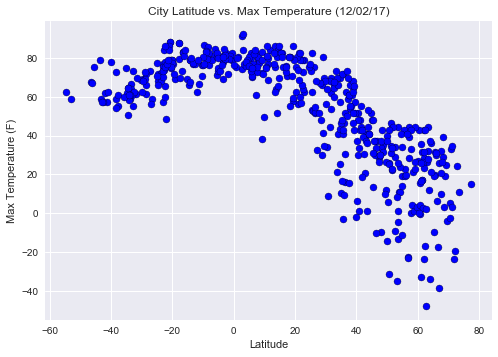
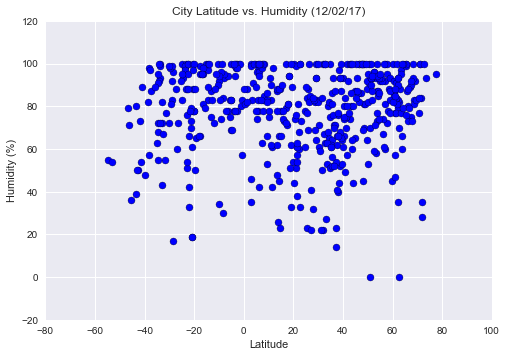
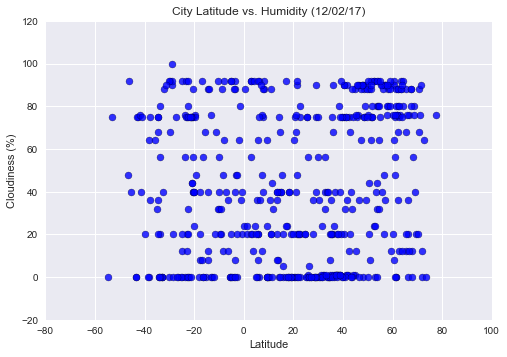
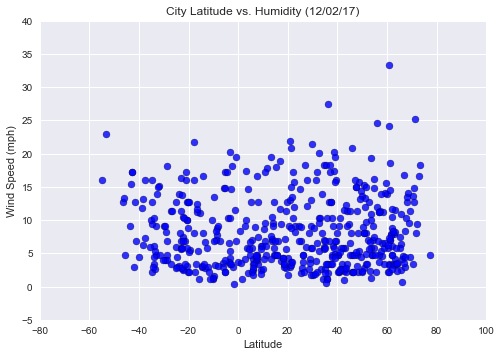

# WeatherPy
## Melvin Garcia


```python
# Import Dependencies
import matplotlib.pyplot as plt
from citipy import citipy
import requests as req
import pandas as pd
import numpy as np
import seaborn
import random
import apikeys
import json
```

## Generate Cities List


```python
# Create random set 2000 latitude and longitude values
# The large random size will allow more choices to choose from and prevent .nearest_city 
# from choosing the same city twice

randlon = np.random.uniform(low=-180, high=181, size=2000).tolist()
randlat = np.random.uniform(low=-90, high=91, size=2000).tolist()
```


```python
# Create list of city names to perform requests on

cities = []

for lat, lon in zip(randlat, randlon):
    city = citipy.nearest_city(lat, lon)
    if city not in cities:
        cities.append(city.city_name)
    else:
        city = citipy.nearest_city(lat, lon)
        cities.append(city.city_name)
```


```python
# Check that you have at least 500 unique city names to perform requests on
len(set(cities))
```


    759


```python
cities_unique = list(set(cities))
```

## Perform API Calls


```python
# Loop through the cities list and perform a request for data on each

url = "http://api.openweathermap.org/data/2.5/weather"

params = {'appid': apikeys.OWM_key,
          'q': '',
          'units': 'imperial'}

weather_data = {'City': [],
               'Cloudiness': [],
               'Country': [],
               'Date': [],
               'Humidity': [],
               'Lat': [],
               'Lng':[],
               'Max_Temp':[],
               'Wind Speed':[]}

city_count = 1
city_count_final = 501

print('Beginning Data Retrieval')
print(print('-----------------------------'))

for city in cities_unique:
    try:
    # Get weather data
        params['q'] = city
        response = req.get(url, params=params).json()
    # Get weather params for df for at least 500 cities
        if city_count == city_count_final:
            print('-----------------------------')
            print('Data Retrieval Complete')
            print('-----------------------------')
            break
        elif city not in weather_data['City']:  
            # Construct weather_data dictionary
            weather_data['City'].append(response['name'])
            weather_data['Cloudiness'].append(response['clouds']['all'])
            weather_data['Country'].append(response['sys']['country'])
            weather_data['Date'].append(response['dt'])
            weather_data['Humidity'].append(response['main']['humidity'])
            weather_data['Lat'].append(response['coord']['lat'])
            weather_data['Lng'].append(response['coord']['lon'])
            weather_data['Max_Temp'].append(response['main']['temp_max'])
            weather_data['Wind Speed'].append(response['wind']['speed'])
            print(f'Processing Record {city_count} of 500 | {city}')
            print(f'http://api.openweathermap.org/data/2.5/weather?units=Imperial&APPID=90ae716c8d520ec3abade149f9b5ba47&q={city.replace(" ", "%20")}')
            city_count += 1
        elif city in weather_data['City']:
            continue
    except KeyError:
        print(f'{city} not found. Skipping...')
```

    Beginning Data Retrieval
    -----------------------------
    None
    Processing Record 1 of 500 | bubaque
    http://api.openweathermap.org/data/2.5/weather?units=Imperial&APPID=90ae716c8d520ec3abade149f9b5ba47&q=bubaque
    Processing Record 2 of 500 | nyimba
    http://api.openweathermap.org/data/2.5/weather?units=Imperial&APPID=90ae716c8d520ec3abade149f9b5ba47&q=nyimba
    Processing Record 3 of 500 | bundaberg
    http://api.openweathermap.org/data/2.5/weather?units=Imperial&APPID=90ae716c8d520ec3abade149f9b5ba47&q=bundaberg
    Processing Record 4 of 500 | flin flon
    http://api.openweathermap.org/data/2.5/weather?units=Imperial&APPID=90ae716c8d520ec3abade149f9b5ba47&q=flin%20flon
    Processing Record 5 of 500 | hay river
    http://api.openweathermap.org/data/2.5/weather?units=Imperial&APPID=90ae716c8d520ec3abade149f9b5ba47&q=hay%20river
    tsentralnyy not found. Skipping...
    Processing Record 6 of 500 | puerto ayora
    http://api.openweathermap.org/data/2.5/weather?units=Imperial&APPID=90ae716c8d520ec3abade149f9b5ba47&q=puerto%20ayora
    Processing Record 7 of 500 | trairi
    http://api.openweathermap.org/data/2.5/weather?units=Imperial&APPID=90ae716c8d520ec3abade149f9b5ba47&q=trairi
    Processing Record 8 of 500 | zima
    http://api.openweathermap.org/data/2.5/weather?units=Imperial&APPID=90ae716c8d520ec3abade149f9b5ba47&q=zima
    Processing Record 9 of 500 | weinan
    http://api.openweathermap.org/data/2.5/weather?units=Imperial&APPID=90ae716c8d520ec3abade149f9b5ba47&q=weinan
    Processing Record 10 of 500 | dzilam gonzalez
    http://api.openweathermap.org/data/2.5/weather?units=Imperial&APPID=90ae716c8d520ec3abade149f9b5ba47&q=dzilam%20gonzalez
    Processing Record 11 of 500 | port blair
    http://api.openweathermap.org/data/2.5/weather?units=Imperial&APPID=90ae716c8d520ec3abade149f9b5ba47&q=port%20blair
    Processing Record 12 of 500 | ormond beach
    http://api.openweathermap.org/data/2.5/weather?units=Imperial&APPID=90ae716c8d520ec3abade149f9b5ba47&q=ormond%20beach
    Processing Record 13 of 500 | kathu
    http://api.openweathermap.org/data/2.5/weather?units=Imperial&APPID=90ae716c8d520ec3abade149f9b5ba47&q=kathu
    nikolskoye not found. Skipping...
    Processing Record 14 of 500 | bambous virieux
    http://api.openweathermap.org/data/2.5/weather?units=Imperial&APPID=90ae716c8d520ec3abade149f9b5ba47&q=bambous%20virieux
    saleaula not found. Skipping...
    Processing Record 15 of 500 | karratha
    http://api.openweathermap.org/data/2.5/weather?units=Imperial&APPID=90ae716c8d520ec3abade149f9b5ba47&q=karratha
    Processing Record 16 of 500 | togur
    http://api.openweathermap.org/data/2.5/weather?units=Imperial&APPID=90ae716c8d520ec3abade149f9b5ba47&q=togur
    Processing Record 17 of 500 | ust-ilimsk
    http://api.openweathermap.org/data/2.5/weather?units=Imperial&APPID=90ae716c8d520ec3abade149f9b5ba47&q=ust-ilimsk
    Processing Record 18 of 500 | vila velha
    http://api.openweathermap.org/data/2.5/weather?units=Imperial&APPID=90ae716c8d520ec3abade149f9b5ba47&q=vila%20velha
    Processing Record 19 of 500 | bitung
    http://api.openweathermap.org/data/2.5/weather?units=Imperial&APPID=90ae716c8d520ec3abade149f9b5ba47&q=bitung
    Processing Record 20 of 500 | oranjemund
    http://api.openweathermap.org/data/2.5/weather?units=Imperial&APPID=90ae716c8d520ec3abade149f9b5ba47&q=oranjemund
    Processing Record 21 of 500 | albany
    http://api.openweathermap.org/data/2.5/weather?units=Imperial&APPID=90ae716c8d520ec3abade149f9b5ba47&q=albany
    Processing Record 22 of 500 | porto belo
    http://api.openweathermap.org/data/2.5/weather?units=Imperial&APPID=90ae716c8d520ec3abade149f9b5ba47&q=porto%20belo
    saryshagan not found. Skipping...
    Processing Record 23 of 500 | timbiqui
    http://api.openweathermap.org/data/2.5/weather?units=Imperial&APPID=90ae716c8d520ec3abade149f9b5ba47&q=timbiqui
    Processing Record 24 of 500 | boa vista
    http://api.openweathermap.org/data/2.5/weather?units=Imperial&APPID=90ae716c8d520ec3abade149f9b5ba47&q=boa%20vista
    airai not found. Skipping...
    Processing Record 25 of 500 | vetluga
    http://api.openweathermap.org/data/2.5/weather?units=Imperial&APPID=90ae716c8d520ec3abade149f9b5ba47&q=vetluga
    Processing Record 26 of 500 | sayansk
    http://api.openweathermap.org/data/2.5/weather?units=Imperial&APPID=90ae716c8d520ec3abade149f9b5ba47&q=sayansk
    Processing Record 27 of 500 | tokur
    http://api.openweathermap.org/data/2.5/weather?units=Imperial&APPID=90ae716c8d520ec3abade149f9b5ba47&q=tokur
    Processing Record 28 of 500 | ribeira grande
    http://api.openweathermap.org/data/2.5/weather?units=Imperial&APPID=90ae716c8d520ec3abade149f9b5ba47&q=ribeira%20grande
    Processing Record 29 of 500 | roebourne
    http://api.openweathermap.org/data/2.5/weather?units=Imperial&APPID=90ae716c8d520ec3abade149f9b5ba47&q=roebourne
    wulanhaote not found. Skipping...
    Processing Record 30 of 500 | cabrobo
    http://api.openweathermap.org/data/2.5/weather?units=Imperial&APPID=90ae716c8d520ec3abade149f9b5ba47&q=cabrobo
    Processing Record 31 of 500 | nanortalik
    http://api.openweathermap.org/data/2.5/weather?units=Imperial&APPID=90ae716c8d520ec3abade149f9b5ba47&q=nanortalik
    Processing Record 32 of 500 | bonfim
    http://api.openweathermap.org/data/2.5/weather?units=Imperial&APPID=90ae716c8d520ec3abade149f9b5ba47&q=bonfim
    Processing Record 33 of 500 | divo
    http://api.openweathermap.org/data/2.5/weather?units=Imperial&APPID=90ae716c8d520ec3abade149f9b5ba47&q=divo
    samana not found. Skipping...
    Processing Record 34 of 500 | uaua
    http://api.openweathermap.org/data/2.5/weather?units=Imperial&APPID=90ae716c8d520ec3abade149f9b5ba47&q=uaua
    Processing Record 35 of 500 | sur
    http://api.openweathermap.org/data/2.5/weather?units=Imperial&APPID=90ae716c8d520ec3abade149f9b5ba47&q=sur
    Processing Record 36 of 500 | mayumba
    http://api.openweathermap.org/data/2.5/weather?units=Imperial&APPID=90ae716c8d520ec3abade149f9b5ba47&q=mayumba
    Processing Record 37 of 500 | acajutla
    http://api.openweathermap.org/data/2.5/weather?units=Imperial&APPID=90ae716c8d520ec3abade149f9b5ba47&q=acajutla
    Processing Record 38 of 500 | lugovskoy
    http://api.openweathermap.org/data/2.5/weather?units=Imperial&APPID=90ae716c8d520ec3abade149f9b5ba47&q=lugovskoy
    Processing Record 39 of 500 | sale
    http://api.openweathermap.org/data/2.5/weather?units=Imperial&APPID=90ae716c8d520ec3abade149f9b5ba47&q=sale
    Processing Record 40 of 500 | san ignacio
    http://api.openweathermap.org/data/2.5/weather?units=Imperial&APPID=90ae716c8d520ec3abade149f9b5ba47&q=san%20ignacio
    Processing Record 41 of 500 | yar-sale
    http://api.openweathermap.org/data/2.5/weather?units=Imperial&APPID=90ae716c8d520ec3abade149f9b5ba47&q=yar-sale
    Processing Record 42 of 500 | rawah
    http://api.openweathermap.org/data/2.5/weather?units=Imperial&APPID=90ae716c8d520ec3abade149f9b5ba47&q=rawah
    Processing Record 43 of 500 | hasaki
    http://api.openweathermap.org/data/2.5/weather?units=Imperial&APPID=90ae716c8d520ec3abade149f9b5ba47&q=hasaki
    Processing Record 44 of 500 | belaya gora
    http://api.openweathermap.org/data/2.5/weather?units=Imperial&APPID=90ae716c8d520ec3abade149f9b5ba47&q=belaya%20gora
    Processing Record 45 of 500 | valley station
    http://api.openweathermap.org/data/2.5/weather?units=Imperial&APPID=90ae716c8d520ec3abade149f9b5ba47&q=valley%20station
    Processing Record 46 of 500 | hamilton
    http://api.openweathermap.org/data/2.5/weather?units=Imperial&APPID=90ae716c8d520ec3abade149f9b5ba47&q=hamilton
    Processing Record 47 of 500 | tura
    http://api.openweathermap.org/data/2.5/weather?units=Imperial&APPID=90ae716c8d520ec3abade149f9b5ba47&q=tura
    Processing Record 48 of 500 | lumphat
    http://api.openweathermap.org/data/2.5/weather?units=Imperial&APPID=90ae716c8d520ec3abade149f9b5ba47&q=lumphat
    Processing Record 49 of 500 | gerede
    http://api.openweathermap.org/data/2.5/weather?units=Imperial&APPID=90ae716c8d520ec3abade149f9b5ba47&q=gerede
    Processing Record 50 of 500 | deep river
    http://api.openweathermap.org/data/2.5/weather?units=Imperial&APPID=90ae716c8d520ec3abade149f9b5ba47&q=deep%20river
    Processing Record 51 of 500 | merauke
    http://api.openweathermap.org/data/2.5/weather?units=Imperial&APPID=90ae716c8d520ec3abade149f9b5ba47&q=merauke
    Processing Record 52 of 500 | san patricio
    http://api.openweathermap.org/data/2.5/weather?units=Imperial&APPID=90ae716c8d520ec3abade149f9b5ba47&q=san%20patricio
    Processing Record 53 of 500 | rikitea
    http://api.openweathermap.org/data/2.5/weather?units=Imperial&APPID=90ae716c8d520ec3abade149f9b5ba47&q=rikitea
    Processing Record 54 of 500 | butaritari
    http://api.openweathermap.org/data/2.5/weather?units=Imperial&APPID=90ae716c8d520ec3abade149f9b5ba47&q=butaritari
    Processing Record 55 of 500 | buala
    http://api.openweathermap.org/data/2.5/weather?units=Imperial&APPID=90ae716c8d520ec3abade149f9b5ba47&q=buala
    Processing Record 56 of 500 | quatre cocos
    http://api.openweathermap.org/data/2.5/weather?units=Imperial&APPID=90ae716c8d520ec3abade149f9b5ba47&q=quatre%20cocos
    Processing Record 57 of 500 | ambilobe
    http://api.openweathermap.org/data/2.5/weather?units=Imperial&APPID=90ae716c8d520ec3abade149f9b5ba47&q=ambilobe
    Processing Record 58 of 500 | puerto palomas
    http://api.openweathermap.org/data/2.5/weather?units=Imperial&APPID=90ae716c8d520ec3abade149f9b5ba47&q=puerto%20palomas
    Processing Record 59 of 500 | modra
    http://api.openweathermap.org/data/2.5/weather?units=Imperial&APPID=90ae716c8d520ec3abade149f9b5ba47&q=modra
    Processing Record 60 of 500 | kuldiga
    http://api.openweathermap.org/data/2.5/weather?units=Imperial&APPID=90ae716c8d520ec3abade149f9b5ba47&q=kuldiga
    Processing Record 61 of 500 | ciudad bolivar
    http://api.openweathermap.org/data/2.5/weather?units=Imperial&APPID=90ae716c8d520ec3abade149f9b5ba47&q=ciudad%20bolivar
    Processing Record 62 of 500 | gimli
    http://api.openweathermap.org/data/2.5/weather?units=Imperial&APPID=90ae716c8d520ec3abade149f9b5ba47&q=gimli
    Processing Record 63 of 500 | aripuana
    http://api.openweathermap.org/data/2.5/weather?units=Imperial&APPID=90ae716c8d520ec3abade149f9b5ba47&q=aripuana
    Processing Record 64 of 500 | muskogee
    http://api.openweathermap.org/data/2.5/weather?units=Imperial&APPID=90ae716c8d520ec3abade149f9b5ba47&q=muskogee
    Processing Record 65 of 500 | komsomolskiy
    http://api.openweathermap.org/data/2.5/weather?units=Imperial&APPID=90ae716c8d520ec3abade149f9b5ba47&q=komsomolskiy
    Processing Record 66 of 500 | kirakira
    http://api.openweathermap.org/data/2.5/weather?units=Imperial&APPID=90ae716c8d520ec3abade149f9b5ba47&q=kirakira
    Processing Record 67 of 500 | skibbereen
    http://api.openweathermap.org/data/2.5/weather?units=Imperial&APPID=90ae716c8d520ec3abade149f9b5ba47&q=skibbereen
    Processing Record 68 of 500 | thompson
    http://api.openweathermap.org/data/2.5/weather?units=Imperial&APPID=90ae716c8d520ec3abade149f9b5ba47&q=thompson
    Processing Record 69 of 500 | vestmanna
    http://api.openweathermap.org/data/2.5/weather?units=Imperial&APPID=90ae716c8d520ec3abade149f9b5ba47&q=vestmanna
    Processing Record 70 of 500 | bouna
    http://api.openweathermap.org/data/2.5/weather?units=Imperial&APPID=90ae716c8d520ec3abade149f9b5ba47&q=bouna
    Processing Record 71 of 500 | brae
    http://api.openweathermap.org/data/2.5/weather?units=Imperial&APPID=90ae716c8d520ec3abade149f9b5ba47&q=brae
    Processing Record 72 of 500 | kieta
    http://api.openweathermap.org/data/2.5/weather?units=Imperial&APPID=90ae716c8d520ec3abade149f9b5ba47&q=kieta
    Processing Record 73 of 500 | kavieng
    http://api.openweathermap.org/data/2.5/weather?units=Imperial&APPID=90ae716c8d520ec3abade149f9b5ba47&q=kavieng
    Processing Record 74 of 500 | tessalit
    http://api.openweathermap.org/data/2.5/weather?units=Imperial&APPID=90ae716c8d520ec3abade149f9b5ba47&q=tessalit
    Processing Record 75 of 500 | lieksa
    http://api.openweathermap.org/data/2.5/weather?units=Imperial&APPID=90ae716c8d520ec3abade149f9b5ba47&q=lieksa
    Processing Record 76 of 500 | maruko
    http://api.openweathermap.org/data/2.5/weather?units=Imperial&APPID=90ae716c8d520ec3abade149f9b5ba47&q=maruko
    Processing Record 77 of 500 | monroe
    http://api.openweathermap.org/data/2.5/weather?units=Imperial&APPID=90ae716c8d520ec3abade149f9b5ba47&q=monroe
    Processing Record 78 of 500 | russell
    http://api.openweathermap.org/data/2.5/weather?units=Imperial&APPID=90ae716c8d520ec3abade149f9b5ba47&q=russell
    Processing Record 79 of 500 | gravdal
    http://api.openweathermap.org/data/2.5/weather?units=Imperial&APPID=90ae716c8d520ec3abade149f9b5ba47&q=gravdal
    Processing Record 80 of 500 | tsumeb
    http://api.openweathermap.org/data/2.5/weather?units=Imperial&APPID=90ae716c8d520ec3abade149f9b5ba47&q=tsumeb
    Processing Record 81 of 500 | nang rong
    http://api.openweathermap.org/data/2.5/weather?units=Imperial&APPID=90ae716c8d520ec3abade149f9b5ba47&q=nang%20rong
    Processing Record 82 of 500 | ampanihy
    http://api.openweathermap.org/data/2.5/weather?units=Imperial&APPID=90ae716c8d520ec3abade149f9b5ba47&q=ampanihy
    Processing Record 83 of 500 | tilichiki
    http://api.openweathermap.org/data/2.5/weather?units=Imperial&APPID=90ae716c8d520ec3abade149f9b5ba47&q=tilichiki
    Processing Record 84 of 500 | saint anthony
    http://api.openweathermap.org/data/2.5/weather?units=Imperial&APPID=90ae716c8d520ec3abade149f9b5ba47&q=saint%20anthony
    Processing Record 85 of 500 | sinnamary
    http://api.openweathermap.org/data/2.5/weather?units=Imperial&APPID=90ae716c8d520ec3abade149f9b5ba47&q=sinnamary
    Processing Record 86 of 500 | kattivakkam
    http://api.openweathermap.org/data/2.5/weather?units=Imperial&APPID=90ae716c8d520ec3abade149f9b5ba47&q=kattivakkam
    Processing Record 87 of 500 | bonavista
    http://api.openweathermap.org/data/2.5/weather?units=Imperial&APPID=90ae716c8d520ec3abade149f9b5ba47&q=bonavista
    bethanien not found. Skipping...
    Processing Record 88 of 500 | sao francisco de assis
    http://api.openweathermap.org/data/2.5/weather?units=Imperial&APPID=90ae716c8d520ec3abade149f9b5ba47&q=sao%20francisco%20de%20assis
    Processing Record 89 of 500 | kahului
    http://api.openweathermap.org/data/2.5/weather?units=Imperial&APPID=90ae716c8d520ec3abade149f9b5ba47&q=kahului
    Processing Record 90 of 500 | martapura
    http://api.openweathermap.org/data/2.5/weather?units=Imperial&APPID=90ae716c8d520ec3abade149f9b5ba47&q=martapura
    artyk not found. Skipping...
    Processing Record 91 of 500 | otavi
    http://api.openweathermap.org/data/2.5/weather?units=Imperial&APPID=90ae716c8d520ec3abade149f9b5ba47&q=otavi
    Processing Record 92 of 500 | sao sebastiao
    http://api.openweathermap.org/data/2.5/weather?units=Imperial&APPID=90ae716c8d520ec3abade149f9b5ba47&q=sao%20sebastiao
    Processing Record 93 of 500 | jacareacanga
    http://api.openweathermap.org/data/2.5/weather?units=Imperial&APPID=90ae716c8d520ec3abade149f9b5ba47&q=jacareacanga
    Processing Record 94 of 500 | los andes
    http://api.openweathermap.org/data/2.5/weather?units=Imperial&APPID=90ae716c8d520ec3abade149f9b5ba47&q=los%20andes
    Processing Record 95 of 500 | sechura
    http://api.openweathermap.org/data/2.5/weather?units=Imperial&APPID=90ae716c8d520ec3abade149f9b5ba47&q=sechura
    Processing Record 96 of 500 | rawson
    http://api.openweathermap.org/data/2.5/weather?units=Imperial&APPID=90ae716c8d520ec3abade149f9b5ba47&q=rawson
    Processing Record 97 of 500 | barahona
    http://api.openweathermap.org/data/2.5/weather?units=Imperial&APPID=90ae716c8d520ec3abade149f9b5ba47&q=barahona
    Processing Record 98 of 500 | fortuna
    http://api.openweathermap.org/data/2.5/weather?units=Imperial&APPID=90ae716c8d520ec3abade149f9b5ba47&q=fortuna
    Processing Record 99 of 500 | rudraprayag
    http://api.openweathermap.org/data/2.5/weather?units=Imperial&APPID=90ae716c8d520ec3abade149f9b5ba47&q=rudraprayag
    Processing Record 100 of 500 | tabas
    http://api.openweathermap.org/data/2.5/weather?units=Imperial&APPID=90ae716c8d520ec3abade149f9b5ba47&q=tabas
    acapulco not found. Skipping...
    Processing Record 101 of 500 | zwedru
    http://api.openweathermap.org/data/2.5/weather?units=Imperial&APPID=90ae716c8d520ec3abade149f9b5ba47&q=zwedru
    biak not found. Skipping...
    Processing Record 102 of 500 | champerico
    http://api.openweathermap.org/data/2.5/weather?units=Imperial&APPID=90ae716c8d520ec3abade149f9b5ba47&q=champerico
    Processing Record 103 of 500 | lompoc
    http://api.openweathermap.org/data/2.5/weather?units=Imperial&APPID=90ae716c8d520ec3abade149f9b5ba47&q=lompoc
    Processing Record 104 of 500 | codrington
    http://api.openweathermap.org/data/2.5/weather?units=Imperial&APPID=90ae716c8d520ec3abade149f9b5ba47&q=codrington
    Processing Record 105 of 500 | walvis bay
    http://api.openweathermap.org/data/2.5/weather?units=Imperial&APPID=90ae716c8d520ec3abade149f9b5ba47&q=walvis%20bay
    Processing Record 106 of 500 | inongo
    http://api.openweathermap.org/data/2.5/weather?units=Imperial&APPID=90ae716c8d520ec3abade149f9b5ba47&q=inongo
    Processing Record 107 of 500 | amga
    http://api.openweathermap.org/data/2.5/weather?units=Imperial&APPID=90ae716c8d520ec3abade149f9b5ba47&q=amga
    Processing Record 108 of 500 | cabo san lucas
    http://api.openweathermap.org/data/2.5/weather?units=Imperial&APPID=90ae716c8d520ec3abade149f9b5ba47&q=cabo%20san%20lucas
    bargal not found. Skipping...
    Processing Record 109 of 500 | itacare
    http://api.openweathermap.org/data/2.5/weather?units=Imperial&APPID=90ae716c8d520ec3abade149f9b5ba47&q=itacare
    yanan not found. Skipping...
    sentyabrskiy not found. Skipping...
    Processing Record 110 of 500 | lebu
    http://api.openweathermap.org/data/2.5/weather?units=Imperial&APPID=90ae716c8d520ec3abade149f9b5ba47&q=lebu
    Processing Record 111 of 500 | yellowknife
    http://api.openweathermap.org/data/2.5/weather?units=Imperial&APPID=90ae716c8d520ec3abade149f9b5ba47&q=yellowknife
    Processing Record 112 of 500 | mathathane
    http://api.openweathermap.org/data/2.5/weather?units=Imperial&APPID=90ae716c8d520ec3abade149f9b5ba47&q=mathathane
    Processing Record 113 of 500 | kirensk
    http://api.openweathermap.org/data/2.5/weather?units=Imperial&APPID=90ae716c8d520ec3abade149f9b5ba47&q=kirensk
    Processing Record 114 of 500 | bud
    http://api.openweathermap.org/data/2.5/weather?units=Imperial&APPID=90ae716c8d520ec3abade149f9b5ba47&q=bud
    Processing Record 115 of 500 | malartic
    http://api.openweathermap.org/data/2.5/weather?units=Imperial&APPID=90ae716c8d520ec3abade149f9b5ba47&q=malartic
    Processing Record 116 of 500 | nautla
    http://api.openweathermap.org/data/2.5/weather?units=Imperial&APPID=90ae716c8d520ec3abade149f9b5ba47&q=nautla
    Processing Record 117 of 500 | namibe
    http://api.openweathermap.org/data/2.5/weather?units=Imperial&APPID=90ae716c8d520ec3abade149f9b5ba47&q=namibe
    Processing Record 118 of 500 | bahar
    http://api.openweathermap.org/data/2.5/weather?units=Imperial&APPID=90ae716c8d520ec3abade149f9b5ba47&q=bahar
    Processing Record 119 of 500 | cherepovets
    http://api.openweathermap.org/data/2.5/weather?units=Imperial&APPID=90ae716c8d520ec3abade149f9b5ba47&q=cherepovets
    Processing Record 120 of 500 | idlib
    http://api.openweathermap.org/data/2.5/weather?units=Imperial&APPID=90ae716c8d520ec3abade149f9b5ba47&q=idlib
    Processing Record 121 of 500 | tasiilaq
    http://api.openweathermap.org/data/2.5/weather?units=Imperial&APPID=90ae716c8d520ec3abade149f9b5ba47&q=tasiilaq
    Processing Record 122 of 500 | luba
    http://api.openweathermap.org/data/2.5/weather?units=Imperial&APPID=90ae716c8d520ec3abade149f9b5ba47&q=luba
    longlac not found. Skipping...
    geresk not found. Skipping...
    vaitupu not found. Skipping...
    Processing Record 123 of 500 | port-gentil
    http://api.openweathermap.org/data/2.5/weather?units=Imperial&APPID=90ae716c8d520ec3abade149f9b5ba47&q=port-gentil
    Processing Record 124 of 500 | kampot
    http://api.openweathermap.org/data/2.5/weather?units=Imperial&APPID=90ae716c8d520ec3abade149f9b5ba47&q=kampot
    pochutla not found. Skipping...
    gudiyattam not found. Skipping...
    Processing Record 125 of 500 | lata
    http://api.openweathermap.org/data/2.5/weather?units=Imperial&APPID=90ae716c8d520ec3abade149f9b5ba47&q=lata
    Processing Record 126 of 500 | poitiers
    http://api.openweathermap.org/data/2.5/weather?units=Imperial&APPID=90ae716c8d520ec3abade149f9b5ba47&q=poitiers
    babanusah not found. Skipping...
    Processing Record 127 of 500 | fort nelson
    http://api.openweathermap.org/data/2.5/weather?units=Imperial&APPID=90ae716c8d520ec3abade149f9b5ba47&q=fort%20nelson
    Processing Record 128 of 500 | whitehorse
    http://api.openweathermap.org/data/2.5/weather?units=Imperial&APPID=90ae716c8d520ec3abade149f9b5ba47&q=whitehorse
    Processing Record 129 of 500 | berlevag
    http://api.openweathermap.org/data/2.5/weather?units=Imperial&APPID=90ae716c8d520ec3abade149f9b5ba47&q=berlevag
    mentok not found. Skipping...
    Processing Record 130 of 500 | marienburg
    http://api.openweathermap.org/data/2.5/weather?units=Imperial&APPID=90ae716c8d520ec3abade149f9b5ba47&q=marienburg
    Processing Record 131 of 500 | sambava
    http://api.openweathermap.org/data/2.5/weather?units=Imperial&APPID=90ae716c8d520ec3abade149f9b5ba47&q=sambava
    Processing Record 132 of 500 | kirsanov
    http://api.openweathermap.org/data/2.5/weather?units=Imperial&APPID=90ae716c8d520ec3abade149f9b5ba47&q=kirsanov
    Processing Record 133 of 500 | geraldton
    http://api.openweathermap.org/data/2.5/weather?units=Imperial&APPID=90ae716c8d520ec3abade149f9b5ba47&q=geraldton
    Processing Record 134 of 500 | nantucket
    http://api.openweathermap.org/data/2.5/weather?units=Imperial&APPID=90ae716c8d520ec3abade149f9b5ba47&q=nantucket
    Processing Record 135 of 500 | pacific grove
    http://api.openweathermap.org/data/2.5/weather?units=Imperial&APPID=90ae716c8d520ec3abade149f9b5ba47&q=pacific%20grove
    Processing Record 136 of 500 | saint-louis
    http://api.openweathermap.org/data/2.5/weather?units=Imperial&APPID=90ae716c8d520ec3abade149f9b5ba47&q=saint-louis
    Processing Record 137 of 500 | bela
    http://api.openweathermap.org/data/2.5/weather?units=Imperial&APPID=90ae716c8d520ec3abade149f9b5ba47&q=bela
    Processing Record 138 of 500 | kalmunai
    http://api.openweathermap.org/data/2.5/weather?units=Imperial&APPID=90ae716c8d520ec3abade149f9b5ba47&q=kalmunai
    rawannawi not found. Skipping...
    Processing Record 139 of 500 | chulman
    http://api.openweathermap.org/data/2.5/weather?units=Imperial&APPID=90ae716c8d520ec3abade149f9b5ba47&q=chulman
    Processing Record 140 of 500 | los llanos de aridane
    http://api.openweathermap.org/data/2.5/weather?units=Imperial&APPID=90ae716c8d520ec3abade149f9b5ba47&q=los%20llanos%20de%20aridane
    Processing Record 141 of 500 | carutapera
    http://api.openweathermap.org/data/2.5/weather?units=Imperial&APPID=90ae716c8d520ec3abade149f9b5ba47&q=carutapera
    Processing Record 142 of 500 | lazaro cardenas
    http://api.openweathermap.org/data/2.5/weather?units=Imperial&APPID=90ae716c8d520ec3abade149f9b5ba47&q=lazaro%20cardenas
    Processing Record 143 of 500 | bethel
    http://api.openweathermap.org/data/2.5/weather?units=Imperial&APPID=90ae716c8d520ec3abade149f9b5ba47&q=bethel
    Processing Record 144 of 500 | sabzevar
    http://api.openweathermap.org/data/2.5/weather?units=Imperial&APPID=90ae716c8d520ec3abade149f9b5ba47&q=sabzevar
    Processing Record 145 of 500 | victoria
    http://api.openweathermap.org/data/2.5/weather?units=Imperial&APPID=90ae716c8d520ec3abade149f9b5ba47&q=victoria
    Processing Record 146 of 500 | pedasi
    http://api.openweathermap.org/data/2.5/weather?units=Imperial&APPID=90ae716c8d520ec3abade149f9b5ba47&q=pedasi
    Processing Record 147 of 500 | saldanha
    http://api.openweathermap.org/data/2.5/weather?units=Imperial&APPID=90ae716c8d520ec3abade149f9b5ba47&q=saldanha
    Processing Record 148 of 500 | launceston
    http://api.openweathermap.org/data/2.5/weather?units=Imperial&APPID=90ae716c8d520ec3abade149f9b5ba47&q=launceston
    taolanaro not found. Skipping...
    Processing Record 149 of 500 | broken hill
    http://api.openweathermap.org/data/2.5/weather?units=Imperial&APPID=90ae716c8d520ec3abade149f9b5ba47&q=broken%20hill
    Processing Record 150 of 500 | souillac
    http://api.openweathermap.org/data/2.5/weather?units=Imperial&APPID=90ae716c8d520ec3abade149f9b5ba47&q=souillac
    Processing Record 151 of 500 | shimoda
    http://api.openweathermap.org/data/2.5/weather?units=Imperial&APPID=90ae716c8d520ec3abade149f9b5ba47&q=shimoda
    Processing Record 152 of 500 | ashqelon
    http://api.openweathermap.org/data/2.5/weather?units=Imperial&APPID=90ae716c8d520ec3abade149f9b5ba47&q=ashqelon
    Processing Record 153 of 500 | leshan
    http://api.openweathermap.org/data/2.5/weather?units=Imperial&APPID=90ae716c8d520ec3abade149f9b5ba47&q=leshan
    Processing Record 154 of 500 | aquiraz
    http://api.openweathermap.org/data/2.5/weather?units=Imperial&APPID=90ae716c8d520ec3abade149f9b5ba47&q=aquiraz
    Processing Record 155 of 500 | bluff
    http://api.openweathermap.org/data/2.5/weather?units=Imperial&APPID=90ae716c8d520ec3abade149f9b5ba47&q=bluff
    Processing Record 156 of 500 | iracoubo
    http://api.openweathermap.org/data/2.5/weather?units=Imperial&APPID=90ae716c8d520ec3abade149f9b5ba47&q=iracoubo
    Processing Record 157 of 500 | bardiyah
    http://api.openweathermap.org/data/2.5/weather?units=Imperial&APPID=90ae716c8d520ec3abade149f9b5ba47&q=bardiyah
    Processing Record 158 of 500 | yumen
    http://api.openweathermap.org/data/2.5/weather?units=Imperial&APPID=90ae716c8d520ec3abade149f9b5ba47&q=yumen
    ye not found. Skipping...
    Processing Record 159 of 500 | new norfolk
    http://api.openweathermap.org/data/2.5/weather?units=Imperial&APPID=90ae716c8d520ec3abade149f9b5ba47&q=new%20norfolk
    Processing Record 160 of 500 | vestmannaeyjar
    http://api.openweathermap.org/data/2.5/weather?units=Imperial&APPID=90ae716c8d520ec3abade149f9b5ba47&q=vestmannaeyjar
    Processing Record 161 of 500 | lexington
    http://api.openweathermap.org/data/2.5/weather?units=Imperial&APPID=90ae716c8d520ec3abade149f9b5ba47&q=lexington
    Processing Record 162 of 500 | dvinskoy
    http://api.openweathermap.org/data/2.5/weather?units=Imperial&APPID=90ae716c8d520ec3abade149f9b5ba47&q=dvinskoy
    Processing Record 163 of 500 | barguzin
    http://api.openweathermap.org/data/2.5/weather?units=Imperial&APPID=90ae716c8d520ec3abade149f9b5ba47&q=barguzin
    Processing Record 164 of 500 | polyarnyy
    http://api.openweathermap.org/data/2.5/weather?units=Imperial&APPID=90ae716c8d520ec3abade149f9b5ba47&q=polyarnyy
    Processing Record 165 of 500 | lavrentiya
    http://api.openweathermap.org/data/2.5/weather?units=Imperial&APPID=90ae716c8d520ec3abade149f9b5ba47&q=lavrentiya
    Processing Record 166 of 500 | san felipe
    http://api.openweathermap.org/data/2.5/weather?units=Imperial&APPID=90ae716c8d520ec3abade149f9b5ba47&q=san%20felipe
    Processing Record 167 of 500 | ostrovnoy
    http://api.openweathermap.org/data/2.5/weather?units=Imperial&APPID=90ae716c8d520ec3abade149f9b5ba47&q=ostrovnoy
    Processing Record 168 of 500 | yarmouth
    http://api.openweathermap.org/data/2.5/weather?units=Imperial&APPID=90ae716c8d520ec3abade149f9b5ba47&q=yarmouth
    Processing Record 169 of 500 | elk city
    http://api.openweathermap.org/data/2.5/weather?units=Imperial&APPID=90ae716c8d520ec3abade149f9b5ba47&q=elk%20city
    Processing Record 170 of 500 | dingle
    http://api.openweathermap.org/data/2.5/weather?units=Imperial&APPID=90ae716c8d520ec3abade149f9b5ba47&q=dingle
    Processing Record 171 of 500 | tuatapere
    http://api.openweathermap.org/data/2.5/weather?units=Imperial&APPID=90ae716c8d520ec3abade149f9b5ba47&q=tuatapere
    Processing Record 172 of 500 | morehead
    http://api.openweathermap.org/data/2.5/weather?units=Imperial&APPID=90ae716c8d520ec3abade149f9b5ba47&q=morehead
    Processing Record 173 of 500 | abay
    http://api.openweathermap.org/data/2.5/weather?units=Imperial&APPID=90ae716c8d520ec3abade149f9b5ba47&q=abay
    Processing Record 174 of 500 | solnechnyy
    http://api.openweathermap.org/data/2.5/weather?units=Imperial&APPID=90ae716c8d520ec3abade149f9b5ba47&q=solnechnyy
    Processing Record 175 of 500 | magadan
    http://api.openweathermap.org/data/2.5/weather?units=Imperial&APPID=90ae716c8d520ec3abade149f9b5ba47&q=magadan
    Processing Record 176 of 500 | westport
    http://api.openweathermap.org/data/2.5/weather?units=Imperial&APPID=90ae716c8d520ec3abade149f9b5ba47&q=westport
    Processing Record 177 of 500 | kapaa
    http://api.openweathermap.org/data/2.5/weather?units=Imperial&APPID=90ae716c8d520ec3abade149f9b5ba47&q=kapaa
    Processing Record 178 of 500 | busselton
    http://api.openweathermap.org/data/2.5/weather?units=Imperial&APPID=90ae716c8d520ec3abade149f9b5ba47&q=busselton
    Processing Record 179 of 500 | teknaf
    http://api.openweathermap.org/data/2.5/weather?units=Imperial&APPID=90ae716c8d520ec3abade149f9b5ba47&q=teknaf
    chagda not found. Skipping...
    Processing Record 180 of 500 | atikokan
    http://api.openweathermap.org/data/2.5/weather?units=Imperial&APPID=90ae716c8d520ec3abade149f9b5ba47&q=atikokan
    Processing Record 181 of 500 | okha
    http://api.openweathermap.org/data/2.5/weather?units=Imperial&APPID=90ae716c8d520ec3abade149f9b5ba47&q=okha
    Processing Record 182 of 500 | namtsy
    http://api.openweathermap.org/data/2.5/weather?units=Imperial&APPID=90ae716c8d520ec3abade149f9b5ba47&q=namtsy
    Processing Record 183 of 500 | jieshi
    http://api.openweathermap.org/data/2.5/weather?units=Imperial&APPID=90ae716c8d520ec3abade149f9b5ba47&q=jieshi
    Processing Record 184 of 500 | srandakan
    http://api.openweathermap.org/data/2.5/weather?units=Imperial&APPID=90ae716c8d520ec3abade149f9b5ba47&q=srandakan
    Processing Record 185 of 500 | glenwood springs
    http://api.openweathermap.org/data/2.5/weather?units=Imperial&APPID=90ae716c8d520ec3abade149f9b5ba47&q=glenwood%20springs
    dubenskiy not found. Skipping...
    Processing Record 186 of 500 | nanakuli
    http://api.openweathermap.org/data/2.5/weather?units=Imperial&APPID=90ae716c8d520ec3abade149f9b5ba47&q=nanakuli
    Processing Record 187 of 500 | alta floresta
    http://api.openweathermap.org/data/2.5/weather?units=Imperial&APPID=90ae716c8d520ec3abade149f9b5ba47&q=alta%20floresta
    Processing Record 188 of 500 | baie-saint-paul
    http://api.openweathermap.org/data/2.5/weather?units=Imperial&APPID=90ae716c8d520ec3abade149f9b5ba47&q=baie-saint-paul
    Processing Record 189 of 500 | kutum
    http://api.openweathermap.org/data/2.5/weather?units=Imperial&APPID=90ae716c8d520ec3abade149f9b5ba47&q=kutum
    Processing Record 190 of 500 | allapalli
    http://api.openweathermap.org/data/2.5/weather?units=Imperial&APPID=90ae716c8d520ec3abade149f9b5ba47&q=allapalli
    Processing Record 191 of 500 | half moon bay
    http://api.openweathermap.org/data/2.5/weather?units=Imperial&APPID=90ae716c8d520ec3abade149f9b5ba47&q=half%20moon%20bay
    Processing Record 192 of 500 | mecca
    http://api.openweathermap.org/data/2.5/weather?units=Imperial&APPID=90ae716c8d520ec3abade149f9b5ba47&q=mecca
    Processing Record 193 of 500 | arraial do cabo
    http://api.openweathermap.org/data/2.5/weather?units=Imperial&APPID=90ae716c8d520ec3abade149f9b5ba47&q=arraial%20do%20cabo
    Processing Record 194 of 500 | casino
    http://api.openweathermap.org/data/2.5/weather?units=Imperial&APPID=90ae716c8d520ec3abade149f9b5ba47&q=casino
    Processing Record 195 of 500 | mayo
    http://api.openweathermap.org/data/2.5/weather?units=Imperial&APPID=90ae716c8d520ec3abade149f9b5ba47&q=mayo
    Processing Record 196 of 500 | onverwacht
    http://api.openweathermap.org/data/2.5/weather?units=Imperial&APPID=90ae716c8d520ec3abade149f9b5ba47&q=onverwacht
    Processing Record 197 of 500 | jamestown
    http://api.openweathermap.org/data/2.5/weather?units=Imperial&APPID=90ae716c8d520ec3abade149f9b5ba47&q=jamestown
    Processing Record 198 of 500 | coquimbo
    http://api.openweathermap.org/data/2.5/weather?units=Imperial&APPID=90ae716c8d520ec3abade149f9b5ba47&q=coquimbo
    Processing Record 199 of 500 | moussoro
    http://api.openweathermap.org/data/2.5/weather?units=Imperial&APPID=90ae716c8d520ec3abade149f9b5ba47&q=moussoro
    Processing Record 200 of 500 | florestopolis
    http://api.openweathermap.org/data/2.5/weather?units=Imperial&APPID=90ae716c8d520ec3abade149f9b5ba47&q=florestopolis
    Processing Record 201 of 500 | husavik
    http://api.openweathermap.org/data/2.5/weather?units=Imperial&APPID=90ae716c8d520ec3abade149f9b5ba47&q=husavik
    Processing Record 202 of 500 | cherskiy
    http://api.openweathermap.org/data/2.5/weather?units=Imperial&APPID=90ae716c8d520ec3abade149f9b5ba47&q=cherskiy
    Processing Record 203 of 500 | nogales
    http://api.openweathermap.org/data/2.5/weather?units=Imperial&APPID=90ae716c8d520ec3abade149f9b5ba47&q=nogales
    kadykchan not found. Skipping...
    Processing Record 204 of 500 | yugorsk
    http://api.openweathermap.org/data/2.5/weather?units=Imperial&APPID=90ae716c8d520ec3abade149f9b5ba47&q=yugorsk
    Processing Record 205 of 500 | imst
    http://api.openweathermap.org/data/2.5/weather?units=Imperial&APPID=90ae716c8d520ec3abade149f9b5ba47&q=imst
    Processing Record 206 of 500 | tolaga bay
    http://api.openweathermap.org/data/2.5/weather?units=Imperial&APPID=90ae716c8d520ec3abade149f9b5ba47&q=tolaga%20bay
    mocuba not found. Skipping...
    barentsburg not found. Skipping...
    Processing Record 207 of 500 | quatis
    http://api.openweathermap.org/data/2.5/weather?units=Imperial&APPID=90ae716c8d520ec3abade149f9b5ba47&q=quatis
    Processing Record 208 of 500 | belyy yar
    http://api.openweathermap.org/data/2.5/weather?units=Imperial&APPID=90ae716c8d520ec3abade149f9b5ba47&q=belyy%20yar
    Processing Record 209 of 500 | sheltozero
    http://api.openweathermap.org/data/2.5/weather?units=Imperial&APPID=90ae716c8d520ec3abade149f9b5ba47&q=sheltozero
    Processing Record 210 of 500 | ixtapa
    http://api.openweathermap.org/data/2.5/weather?units=Imperial&APPID=90ae716c8d520ec3abade149f9b5ba47&q=ixtapa
    Processing Record 211 of 500 | miramar
    http://api.openweathermap.org/data/2.5/weather?units=Imperial&APPID=90ae716c8d520ec3abade149f9b5ba47&q=miramar
    Processing Record 212 of 500 | tlaltenango
    http://api.openweathermap.org/data/2.5/weather?units=Imperial&APPID=90ae716c8d520ec3abade149f9b5ba47&q=tlaltenango
    Processing Record 213 of 500 | flinders
    http://api.openweathermap.org/data/2.5/weather?units=Imperial&APPID=90ae716c8d520ec3abade149f9b5ba47&q=flinders
    keshan not found. Skipping...
    Processing Record 214 of 500 | ocampo
    http://api.openweathermap.org/data/2.5/weather?units=Imperial&APPID=90ae716c8d520ec3abade149f9b5ba47&q=ocampo
    Processing Record 215 of 500 | villazon
    http://api.openweathermap.org/data/2.5/weather?units=Imperial&APPID=90ae716c8d520ec3abade149f9b5ba47&q=villazon
    Processing Record 216 of 500 | port elizabeth
    http://api.openweathermap.org/data/2.5/weather?units=Imperial&APPID=90ae716c8d520ec3abade149f9b5ba47&q=port%20elizabeth
    Processing Record 217 of 500 | paita
    http://api.openweathermap.org/data/2.5/weather?units=Imperial&APPID=90ae716c8d520ec3abade149f9b5ba47&q=paita
    Processing Record 218 of 500 | amahai
    http://api.openweathermap.org/data/2.5/weather?units=Imperial&APPID=90ae716c8d520ec3abade149f9b5ba47&q=amahai
    Processing Record 219 of 500 | conde
    http://api.openweathermap.org/data/2.5/weather?units=Imperial&APPID=90ae716c8d520ec3abade149f9b5ba47&q=conde
    raudeberg not found. Skipping...
    samalaeulu not found. Skipping...
    Processing Record 220 of 500 | chitral
    http://api.openweathermap.org/data/2.5/weather?units=Imperial&APPID=90ae716c8d520ec3abade149f9b5ba47&q=chitral
    Processing Record 221 of 500 | hovd
    http://api.openweathermap.org/data/2.5/weather?units=Imperial&APPID=90ae716c8d520ec3abade149f9b5ba47&q=hovd
    Processing Record 222 of 500 | srednekolymsk
    http://api.openweathermap.org/data/2.5/weather?units=Imperial&APPID=90ae716c8d520ec3abade149f9b5ba47&q=srednekolymsk
    Processing Record 223 of 500 | khatanga
    http://api.openweathermap.org/data/2.5/weather?units=Imperial&APPID=90ae716c8d520ec3abade149f9b5ba47&q=khatanga
    Processing Record 224 of 500 | galveston
    http://api.openweathermap.org/data/2.5/weather?units=Imperial&APPID=90ae716c8d520ec3abade149f9b5ba47&q=galveston
    Processing Record 225 of 500 | haines junction
    http://api.openweathermap.org/data/2.5/weather?units=Imperial&APPID=90ae716c8d520ec3abade149f9b5ba47&q=haines%20junction
    Processing Record 226 of 500 | iralaya
    http://api.openweathermap.org/data/2.5/weather?units=Imperial&APPID=90ae716c8d520ec3abade149f9b5ba47&q=iralaya
    Processing Record 227 of 500 | ponta do sol
    http://api.openweathermap.org/data/2.5/weather?units=Imperial&APPID=90ae716c8d520ec3abade149f9b5ba47&q=ponta%20do%20sol
    Processing Record 228 of 500 | omboue
    http://api.openweathermap.org/data/2.5/weather?units=Imperial&APPID=90ae716c8d520ec3abade149f9b5ba47&q=omboue
    mataura not found. Skipping...
    Processing Record 229 of 500 | kysyl-syr
    http://api.openweathermap.org/data/2.5/weather?units=Imperial&APPID=90ae716c8d520ec3abade149f9b5ba47&q=kysyl-syr
    Processing Record 230 of 500 | hobart
    http://api.openweathermap.org/data/2.5/weather?units=Imperial&APPID=90ae716c8d520ec3abade149f9b5ba47&q=hobart
    addis abeba not found. Skipping...
    Processing Record 231 of 500 | dikson
    http://api.openweathermap.org/data/2.5/weather?units=Imperial&APPID=90ae716c8d520ec3abade149f9b5ba47&q=dikson
    Processing Record 232 of 500 | saint-paul
    http://api.openweathermap.org/data/2.5/weather?units=Imperial&APPID=90ae716c8d520ec3abade149f9b5ba47&q=saint-paul
    Processing Record 233 of 500 | coihaique
    http://api.openweathermap.org/data/2.5/weather?units=Imperial&APPID=90ae716c8d520ec3abade149f9b5ba47&q=coihaique
    Processing Record 234 of 500 | vilhena
    http://api.openweathermap.org/data/2.5/weather?units=Imperial&APPID=90ae716c8d520ec3abade149f9b5ba47&q=vilhena
    Processing Record 235 of 500 | warrington
    http://api.openweathermap.org/data/2.5/weather?units=Imperial&APPID=90ae716c8d520ec3abade149f9b5ba47&q=warrington
    Processing Record 236 of 500 | rabo de peixe
    http://api.openweathermap.org/data/2.5/weather?units=Imperial&APPID=90ae716c8d520ec3abade149f9b5ba47&q=rabo%20de%20peixe
    Processing Record 237 of 500 | necochea
    http://api.openweathermap.org/data/2.5/weather?units=Imperial&APPID=90ae716c8d520ec3abade149f9b5ba47&q=necochea
    Processing Record 238 of 500 | muisne
    http://api.openweathermap.org/data/2.5/weather?units=Imperial&APPID=90ae716c8d520ec3abade149f9b5ba47&q=muisne
    Processing Record 239 of 500 | chokurdakh
    http://api.openweathermap.org/data/2.5/weather?units=Imperial&APPID=90ae716c8d520ec3abade149f9b5ba47&q=chokurdakh
    Processing Record 240 of 500 | griffith
    http://api.openweathermap.org/data/2.5/weather?units=Imperial&APPID=90ae716c8d520ec3abade149f9b5ba47&q=griffith
    Processing Record 241 of 500 | bredasdorp
    http://api.openweathermap.org/data/2.5/weather?units=Imperial&APPID=90ae716c8d520ec3abade149f9b5ba47&q=bredasdorp
    Processing Record 242 of 500 | taos
    http://api.openweathermap.org/data/2.5/weather?units=Imperial&APPID=90ae716c8d520ec3abade149f9b5ba47&q=taos
    Processing Record 243 of 500 | valparaiso
    http://api.openweathermap.org/data/2.5/weather?units=Imperial&APPID=90ae716c8d520ec3abade149f9b5ba47&q=valparaiso
    Processing Record 244 of 500 | tazovskiy
    http://api.openweathermap.org/data/2.5/weather?units=Imperial&APPID=90ae716c8d520ec3abade149f9b5ba47&q=tazovskiy
    Processing Record 245 of 500 | luderitz
    http://api.openweathermap.org/data/2.5/weather?units=Imperial&APPID=90ae716c8d520ec3abade149f9b5ba47&q=luderitz
    Processing Record 246 of 500 | chengde
    http://api.openweathermap.org/data/2.5/weather?units=Imperial&APPID=90ae716c8d520ec3abade149f9b5ba47&q=chengde
    Processing Record 247 of 500 | udachnyy
    http://api.openweathermap.org/data/2.5/weather?units=Imperial&APPID=90ae716c8d520ec3abade149f9b5ba47&q=udachnyy
    Processing Record 248 of 500 | shenkursk
    http://api.openweathermap.org/data/2.5/weather?units=Imperial&APPID=90ae716c8d520ec3abade149f9b5ba47&q=shenkursk
    Processing Record 249 of 500 | lodja
    http://api.openweathermap.org/data/2.5/weather?units=Imperial&APPID=90ae716c8d520ec3abade149f9b5ba47&q=lodja
    Processing Record 250 of 500 | nakhon phanom
    http://api.openweathermap.org/data/2.5/weather?units=Imperial&APPID=90ae716c8d520ec3abade149f9b5ba47&q=nakhon%20phanom
    Processing Record 251 of 500 | sao miguel do araguaia
    http://api.openweathermap.org/data/2.5/weather?units=Imperial&APPID=90ae716c8d520ec3abade149f9b5ba47&q=sao%20miguel%20do%20araguaia
    Processing Record 252 of 500 | craigieburn
    http://api.openweathermap.org/data/2.5/weather?units=Imperial&APPID=90ae716c8d520ec3abade149f9b5ba47&q=craigieburn
    dibaya not found. Skipping...
    Processing Record 253 of 500 | afrikanda
    http://api.openweathermap.org/data/2.5/weather?units=Imperial&APPID=90ae716c8d520ec3abade149f9b5ba47&q=afrikanda
    Processing Record 254 of 500 | margate
    http://api.openweathermap.org/data/2.5/weather?units=Imperial&APPID=90ae716c8d520ec3abade149f9b5ba47&q=margate
    safwah not found. Skipping...
    Processing Record 255 of 500 | mabaruma
    http://api.openweathermap.org/data/2.5/weather?units=Imperial&APPID=90ae716c8d520ec3abade149f9b5ba47&q=mabaruma
    Processing Record 256 of 500 | carbonia
    http://api.openweathermap.org/data/2.5/weather?units=Imperial&APPID=90ae716c8d520ec3abade149f9b5ba47&q=carbonia
    Processing Record 257 of 500 | baykit
    http://api.openweathermap.org/data/2.5/weather?units=Imperial&APPID=90ae716c8d520ec3abade149f9b5ba47&q=baykit
    Processing Record 258 of 500 | san cristobal
    http://api.openweathermap.org/data/2.5/weather?units=Imperial&APPID=90ae716c8d520ec3abade149f9b5ba47&q=san%20cristobal
    amderma not found. Skipping...
    Processing Record 259 of 500 | biltine
    http://api.openweathermap.org/data/2.5/weather?units=Imperial&APPID=90ae716c8d520ec3abade149f9b5ba47&q=biltine
    Processing Record 260 of 500 | pyaozerskiy
    http://api.openweathermap.org/data/2.5/weather?units=Imperial&APPID=90ae716c8d520ec3abade149f9b5ba47&q=pyaozerskiy
    Processing Record 261 of 500 | cayenne
    http://api.openweathermap.org/data/2.5/weather?units=Imperial&APPID=90ae716c8d520ec3abade149f9b5ba47&q=cayenne
    Processing Record 262 of 500 | kuah
    http://api.openweathermap.org/data/2.5/weather?units=Imperial&APPID=90ae716c8d520ec3abade149f9b5ba47&q=kuah
    Processing Record 263 of 500 | ngaoundere
    http://api.openweathermap.org/data/2.5/weather?units=Imperial&APPID=90ae716c8d520ec3abade149f9b5ba47&q=ngaoundere
    Processing Record 264 of 500 | umm lajj
    http://api.openweathermap.org/data/2.5/weather?units=Imperial&APPID=90ae716c8d520ec3abade149f9b5ba47&q=umm%20lajj
    Processing Record 265 of 500 | tuktoyaktuk
    http://api.openweathermap.org/data/2.5/weather?units=Imperial&APPID=90ae716c8d520ec3abade149f9b5ba47&q=tuktoyaktuk
    bacuit not found. Skipping...
    Processing Record 266 of 500 | harper
    http://api.openweathermap.org/data/2.5/weather?units=Imperial&APPID=90ae716c8d520ec3abade149f9b5ba47&q=harper
    Processing Record 267 of 500 | poshtove
    http://api.openweathermap.org/data/2.5/weather?units=Imperial&APPID=90ae716c8d520ec3abade149f9b5ba47&q=poshtove
    Processing Record 268 of 500 | batticaloa
    http://api.openweathermap.org/data/2.5/weather?units=Imperial&APPID=90ae716c8d520ec3abade149f9b5ba47&q=batticaloa
    Processing Record 269 of 500 | lukulu
    http://api.openweathermap.org/data/2.5/weather?units=Imperial&APPID=90ae716c8d520ec3abade149f9b5ba47&q=lukulu
    Processing Record 270 of 500 | beringovskiy
    http://api.openweathermap.org/data/2.5/weather?units=Imperial&APPID=90ae716c8d520ec3abade149f9b5ba47&q=beringovskiy
    Processing Record 271 of 500 | grand forks
    http://api.openweathermap.org/data/2.5/weather?units=Imperial&APPID=90ae716c8d520ec3abade149f9b5ba47&q=grand%20forks
    Processing Record 272 of 500 | abomsa
    http://api.openweathermap.org/data/2.5/weather?units=Imperial&APPID=90ae716c8d520ec3abade149f9b5ba47&q=abomsa
    Processing Record 273 of 500 | pangnirtung
    http://api.openweathermap.org/data/2.5/weather?units=Imperial&APPID=90ae716c8d520ec3abade149f9b5ba47&q=pangnirtung
    Processing Record 274 of 500 | hilo
    http://api.openweathermap.org/data/2.5/weather?units=Imperial&APPID=90ae716c8d520ec3abade149f9b5ba47&q=hilo
    ji-parana not found. Skipping...
    Processing Record 275 of 500 | mtama
    http://api.openweathermap.org/data/2.5/weather?units=Imperial&APPID=90ae716c8d520ec3abade149f9b5ba47&q=mtama
    Processing Record 276 of 500 | port alfred
    http://api.openweathermap.org/data/2.5/weather?units=Imperial&APPID=90ae716c8d520ec3abade149f9b5ba47&q=port%20alfred
    Processing Record 277 of 500 | auki
    http://api.openweathermap.org/data/2.5/weather?units=Imperial&APPID=90ae716c8d520ec3abade149f9b5ba47&q=auki
    Processing Record 278 of 500 | uvalde
    http://api.openweathermap.org/data/2.5/weather?units=Imperial&APPID=90ae716c8d520ec3abade149f9b5ba47&q=uvalde
    Processing Record 279 of 500 | bend
    http://api.openweathermap.org/data/2.5/weather?units=Imperial&APPID=90ae716c8d520ec3abade149f9b5ba47&q=bend
    Processing Record 280 of 500 | puerto cabezas
    http://api.openweathermap.org/data/2.5/weather?units=Imperial&APPID=90ae716c8d520ec3abade149f9b5ba47&q=puerto%20cabezas
    mergui not found. Skipping...
    Processing Record 281 of 500 | shaunavon
    http://api.openweathermap.org/data/2.5/weather?units=Imperial&APPID=90ae716c8d520ec3abade149f9b5ba47&q=shaunavon
    Processing Record 282 of 500 | sola
    http://api.openweathermap.org/data/2.5/weather?units=Imperial&APPID=90ae716c8d520ec3abade149f9b5ba47&q=sola
    satitoa not found. Skipping...
    Processing Record 283 of 500 | dongsheng
    http://api.openweathermap.org/data/2.5/weather?units=Imperial&APPID=90ae716c8d520ec3abade149f9b5ba47&q=dongsheng
    Processing Record 284 of 500 | taoudenni
    http://api.openweathermap.org/data/2.5/weather?units=Imperial&APPID=90ae716c8d520ec3abade149f9b5ba47&q=taoudenni
    Processing Record 285 of 500 | khromtau
    http://api.openweathermap.org/data/2.5/weather?units=Imperial&APPID=90ae716c8d520ec3abade149f9b5ba47&q=khromtau
    Processing Record 286 of 500 | puerto escondido
    http://api.openweathermap.org/data/2.5/weather?units=Imperial&APPID=90ae716c8d520ec3abade149f9b5ba47&q=puerto%20escondido
    kismayo not found. Skipping...
    Processing Record 287 of 500 | shenjiamen
    http://api.openweathermap.org/data/2.5/weather?units=Imperial&APPID=90ae716c8d520ec3abade149f9b5ba47&q=shenjiamen
    Processing Record 288 of 500 | sosnovo-ozerskoye
    http://api.openweathermap.org/data/2.5/weather?units=Imperial&APPID=90ae716c8d520ec3abade149f9b5ba47&q=sosnovo-ozerskoye
    Processing Record 289 of 500 | svetlogorsk
    http://api.openweathermap.org/data/2.5/weather?units=Imperial&APPID=90ae716c8d520ec3abade149f9b5ba47&q=svetlogorsk
    Processing Record 290 of 500 | methoni
    http://api.openweathermap.org/data/2.5/weather?units=Imperial&APPID=90ae716c8d520ec3abade149f9b5ba47&q=methoni
    Processing Record 291 of 500 | tateyama
    http://api.openweathermap.org/data/2.5/weather?units=Imperial&APPID=90ae716c8d520ec3abade149f9b5ba47&q=tateyama
    Processing Record 292 of 500 | honningsvag
    http://api.openweathermap.org/data/2.5/weather?units=Imperial&APPID=90ae716c8d520ec3abade149f9b5ba47&q=honningsvag
    Processing Record 293 of 500 | hauterive
    http://api.openweathermap.org/data/2.5/weather?units=Imperial&APPID=90ae716c8d520ec3abade149f9b5ba47&q=hauterive
    Processing Record 294 of 500 | acarau
    http://api.openweathermap.org/data/2.5/weather?units=Imperial&APPID=90ae716c8d520ec3abade149f9b5ba47&q=acarau
    Processing Record 295 of 500 | zaraza
    http://api.openweathermap.org/data/2.5/weather?units=Imperial&APPID=90ae716c8d520ec3abade149f9b5ba47&q=zaraza
    Processing Record 296 of 500 | kidal
    http://api.openweathermap.org/data/2.5/weather?units=Imperial&APPID=90ae716c8d520ec3abade149f9b5ba47&q=kidal
    Processing Record 297 of 500 | emerald
    http://api.openweathermap.org/data/2.5/weather?units=Imperial&APPID=90ae716c8d520ec3abade149f9b5ba47&q=emerald
    Processing Record 298 of 500 | veraval
    http://api.openweathermap.org/data/2.5/weather?units=Imperial&APPID=90ae716c8d520ec3abade149f9b5ba47&q=veraval
    Processing Record 299 of 500 | mineiros
    http://api.openweathermap.org/data/2.5/weather?units=Imperial&APPID=90ae716c8d520ec3abade149f9b5ba47&q=mineiros
    Processing Record 300 of 500 | barkly west
    http://api.openweathermap.org/data/2.5/weather?units=Imperial&APPID=90ae716c8d520ec3abade149f9b5ba47&q=barkly%20west
    Processing Record 301 of 500 | malakal
    http://api.openweathermap.org/data/2.5/weather?units=Imperial&APPID=90ae716c8d520ec3abade149f9b5ba47&q=malakal
    Processing Record 302 of 500 | portland
    http://api.openweathermap.org/data/2.5/weather?units=Imperial&APPID=90ae716c8d520ec3abade149f9b5ba47&q=portland
    Processing Record 303 of 500 | daru
    http://api.openweathermap.org/data/2.5/weather?units=Imperial&APPID=90ae716c8d520ec3abade149f9b5ba47&q=daru
    Processing Record 304 of 500 | buraydah
    http://api.openweathermap.org/data/2.5/weather?units=Imperial&APPID=90ae716c8d520ec3abade149f9b5ba47&q=buraydah
    Processing Record 305 of 500 | betioky
    http://api.openweathermap.org/data/2.5/weather?units=Imperial&APPID=90ae716c8d520ec3abade149f9b5ba47&q=betioky
    Processing Record 306 of 500 | galesong
    http://api.openweathermap.org/data/2.5/weather?units=Imperial&APPID=90ae716c8d520ec3abade149f9b5ba47&q=galesong
    Processing Record 307 of 500 | yurty
    http://api.openweathermap.org/data/2.5/weather?units=Imperial&APPID=90ae716c8d520ec3abade149f9b5ba47&q=yurty
    Processing Record 308 of 500 | sitka
    http://api.openweathermap.org/data/2.5/weather?units=Imperial&APPID=90ae716c8d520ec3abade149f9b5ba47&q=sitka
    Processing Record 309 of 500 | belton
    http://api.openweathermap.org/data/2.5/weather?units=Imperial&APPID=90ae716c8d520ec3abade149f9b5ba47&q=belton
    Processing Record 310 of 500 | kulhudhuffushi
    http://api.openweathermap.org/data/2.5/weather?units=Imperial&APPID=90ae716c8d520ec3abade149f9b5ba47&q=kulhudhuffushi
    Processing Record 311 of 500 | zhuhai
    http://api.openweathermap.org/data/2.5/weather?units=Imperial&APPID=90ae716c8d520ec3abade149f9b5ba47&q=zhuhai
    Processing Record 312 of 500 | matamoros
    http://api.openweathermap.org/data/2.5/weather?units=Imperial&APPID=90ae716c8d520ec3abade149f9b5ba47&q=matamoros
    Processing Record 313 of 500 | ketchikan
    http://api.openweathermap.org/data/2.5/weather?units=Imperial&APPID=90ae716c8d520ec3abade149f9b5ba47&q=ketchikan
    Processing Record 314 of 500 | hirna
    http://api.openweathermap.org/data/2.5/weather?units=Imperial&APPID=90ae716c8d520ec3abade149f9b5ba47&q=hirna
    pundaguitan not found. Skipping...
    Processing Record 315 of 500 | maraba
    http://api.openweathermap.org/data/2.5/weather?units=Imperial&APPID=90ae716c8d520ec3abade149f9b5ba47&q=maraba
    faya not found. Skipping...
    Processing Record 316 of 500 | distraccion
    http://api.openweathermap.org/data/2.5/weather?units=Imperial&APPID=90ae716c8d520ec3abade149f9b5ba47&q=distraccion
    Processing Record 317 of 500 | kamenka
    http://api.openweathermap.org/data/2.5/weather?units=Imperial&APPID=90ae716c8d520ec3abade149f9b5ba47&q=kamenka
    Processing Record 318 of 500 | shelburne
    http://api.openweathermap.org/data/2.5/weather?units=Imperial&APPID=90ae716c8d520ec3abade149f9b5ba47&q=shelburne
    Processing Record 319 of 500 | meulaboh
    http://api.openweathermap.org/data/2.5/weather?units=Imperial&APPID=90ae716c8d520ec3abade149f9b5ba47&q=meulaboh
    Processing Record 320 of 500 | vao
    http://api.openweathermap.org/data/2.5/weather?units=Imperial&APPID=90ae716c8d520ec3abade149f9b5ba47&q=vao
    Processing Record 321 of 500 | mbengwi
    http://api.openweathermap.org/data/2.5/weather?units=Imperial&APPID=90ae716c8d520ec3abade149f9b5ba47&q=mbengwi
    Processing Record 322 of 500 | aracruz
    http://api.openweathermap.org/data/2.5/weather?units=Imperial&APPID=90ae716c8d520ec3abade149f9b5ba47&q=aracruz
    Processing Record 323 of 500 | laguna
    http://api.openweathermap.org/data/2.5/weather?units=Imperial&APPID=90ae716c8d520ec3abade149f9b5ba47&q=laguna
    Processing Record 324 of 500 | ancud
    http://api.openweathermap.org/data/2.5/weather?units=Imperial&APPID=90ae716c8d520ec3abade149f9b5ba47&q=ancud
    Processing Record 325 of 500 | christchurch
    http://api.openweathermap.org/data/2.5/weather?units=Imperial&APPID=90ae716c8d520ec3abade149f9b5ba47&q=christchurch
    Processing Record 326 of 500 | estelle
    http://api.openweathermap.org/data/2.5/weather?units=Imperial&APPID=90ae716c8d520ec3abade149f9b5ba47&q=estelle
    Processing Record 327 of 500 | vaitape
    http://api.openweathermap.org/data/2.5/weather?units=Imperial&APPID=90ae716c8d520ec3abade149f9b5ba47&q=vaitape
    Processing Record 328 of 500 | avarua
    http://api.openweathermap.org/data/2.5/weather?units=Imperial&APPID=90ae716c8d520ec3abade149f9b5ba47&q=avarua
    Processing Record 329 of 500 | that phanom
    http://api.openweathermap.org/data/2.5/weather?units=Imperial&APPID=90ae716c8d520ec3abade149f9b5ba47&q=that%20phanom
    Processing Record 330 of 500 | colchester
    http://api.openweathermap.org/data/2.5/weather?units=Imperial&APPID=90ae716c8d520ec3abade149f9b5ba47&q=colchester
    Processing Record 331 of 500 | xixiang
    http://api.openweathermap.org/data/2.5/weather?units=Imperial&APPID=90ae716c8d520ec3abade149f9b5ba47&q=xixiang
    Processing Record 332 of 500 | kruisfontein
    http://api.openweathermap.org/data/2.5/weather?units=Imperial&APPID=90ae716c8d520ec3abade149f9b5ba47&q=kruisfontein
    Processing Record 333 of 500 | somerset
    http://api.openweathermap.org/data/2.5/weather?units=Imperial&APPID=90ae716c8d520ec3abade149f9b5ba47&q=somerset
    Processing Record 334 of 500 | lang son
    http://api.openweathermap.org/data/2.5/weather?units=Imperial&APPID=90ae716c8d520ec3abade149f9b5ba47&q=lang%20son
    Processing Record 335 of 500 | vrangel
    http://api.openweathermap.org/data/2.5/weather?units=Imperial&APPID=90ae716c8d520ec3abade149f9b5ba47&q=vrangel
    Processing Record 336 of 500 | port augusta
    http://api.openweathermap.org/data/2.5/weather?units=Imperial&APPID=90ae716c8d520ec3abade149f9b5ba47&q=port%20augusta
    Processing Record 337 of 500 | iranshahr
    http://api.openweathermap.org/data/2.5/weather?units=Imperial&APPID=90ae716c8d520ec3abade149f9b5ba47&q=iranshahr
    Processing Record 338 of 500 | port lincoln
    http://api.openweathermap.org/data/2.5/weather?units=Imperial&APPID=90ae716c8d520ec3abade149f9b5ba47&q=port%20lincoln
    Processing Record 339 of 500 | krasnoborsk
    http://api.openweathermap.org/data/2.5/weather?units=Imperial&APPID=90ae716c8d520ec3abade149f9b5ba47&q=krasnoborsk
    Processing Record 340 of 500 | inirida
    http://api.openweathermap.org/data/2.5/weather?units=Imperial&APPID=90ae716c8d520ec3abade149f9b5ba47&q=inirida
    Processing Record 341 of 500 | outlook
    http://api.openweathermap.org/data/2.5/weather?units=Imperial&APPID=90ae716c8d520ec3abade149f9b5ba47&q=outlook
    senai not found. Skipping...
    Processing Record 342 of 500 | asau
    http://api.openweathermap.org/data/2.5/weather?units=Imperial&APPID=90ae716c8d520ec3abade149f9b5ba47&q=asau
    Processing Record 343 of 500 | ahipara
    http://api.openweathermap.org/data/2.5/weather?units=Imperial&APPID=90ae716c8d520ec3abade149f9b5ba47&q=ahipara
    Processing Record 344 of 500 | duku
    http://api.openweathermap.org/data/2.5/weather?units=Imperial&APPID=90ae716c8d520ec3abade149f9b5ba47&q=duku
    Processing Record 345 of 500 | zarand
    http://api.openweathermap.org/data/2.5/weather?units=Imperial&APPID=90ae716c8d520ec3abade149f9b5ba47&q=zarand
    Processing Record 346 of 500 | caravelas
    http://api.openweathermap.org/data/2.5/weather?units=Imperial&APPID=90ae716c8d520ec3abade149f9b5ba47&q=caravelas
    Processing Record 347 of 500 | lima
    http://api.openweathermap.org/data/2.5/weather?units=Imperial&APPID=90ae716c8d520ec3abade149f9b5ba47&q=lima
    palabuhanratu not found. Skipping...
    Processing Record 348 of 500 | san quintin
    http://api.openweathermap.org/data/2.5/weather?units=Imperial&APPID=90ae716c8d520ec3abade149f9b5ba47&q=san%20quintin
    Processing Record 349 of 500 | maniitsoq
    http://api.openweathermap.org/data/2.5/weather?units=Imperial&APPID=90ae716c8d520ec3abade149f9b5ba47&q=maniitsoq
    Processing Record 350 of 500 | saskylakh
    http://api.openweathermap.org/data/2.5/weather?units=Imperial&APPID=90ae716c8d520ec3abade149f9b5ba47&q=saskylakh
    chardara not found. Skipping...
    Processing Record 351 of 500 | paamiut
    http://api.openweathermap.org/data/2.5/weather?units=Imperial&APPID=90ae716c8d520ec3abade149f9b5ba47&q=paamiut
    Processing Record 352 of 500 | ceres
    http://api.openweathermap.org/data/2.5/weather?units=Imperial&APPID=90ae716c8d520ec3abade149f9b5ba47&q=ceres
    Processing Record 353 of 500 | rancho palos verdes
    http://api.openweathermap.org/data/2.5/weather?units=Imperial&APPID=90ae716c8d520ec3abade149f9b5ba47&q=rancho%20palos%20verdes
    Processing Record 354 of 500 | blagoyevo
    http://api.openweathermap.org/data/2.5/weather?units=Imperial&APPID=90ae716c8d520ec3abade149f9b5ba47&q=blagoyevo
    Processing Record 355 of 500 | stromness
    http://api.openweathermap.org/data/2.5/weather?units=Imperial&APPID=90ae716c8d520ec3abade149f9b5ba47&q=stromness
    Processing Record 356 of 500 | neryungri
    http://api.openweathermap.org/data/2.5/weather?units=Imperial&APPID=90ae716c8d520ec3abade149f9b5ba47&q=neryungri
    glenluce not found. Skipping...
    Processing Record 357 of 500 | ihosy
    http://api.openweathermap.org/data/2.5/weather?units=Imperial&APPID=90ae716c8d520ec3abade149f9b5ba47&q=ihosy
    barbar not found. Skipping...
    Processing Record 358 of 500 | zykovo
    http://api.openweathermap.org/data/2.5/weather?units=Imperial&APPID=90ae716c8d520ec3abade149f9b5ba47&q=zykovo
    Processing Record 359 of 500 | manggar
    http://api.openweathermap.org/data/2.5/weather?units=Imperial&APPID=90ae716c8d520ec3abade149f9b5ba47&q=manggar
    Processing Record 360 of 500 | touros
    http://api.openweathermap.org/data/2.5/weather?units=Imperial&APPID=90ae716c8d520ec3abade149f9b5ba47&q=touros
    Processing Record 361 of 500 | fare
    http://api.openweathermap.org/data/2.5/weather?units=Imperial&APPID=90ae716c8d520ec3abade149f9b5ba47&q=fare
    Processing Record 362 of 500 | xai-xai
    http://api.openweathermap.org/data/2.5/weather?units=Imperial&APPID=90ae716c8d520ec3abade149f9b5ba47&q=xai-xai
    Processing Record 363 of 500 | syracuse
    http://api.openweathermap.org/data/2.5/weather?units=Imperial&APPID=90ae716c8d520ec3abade149f9b5ba47&q=syracuse
    Processing Record 364 of 500 | banda aceh
    http://api.openweathermap.org/data/2.5/weather?units=Imperial&APPID=90ae716c8d520ec3abade149f9b5ba47&q=banda%20aceh
    bosaso not found. Skipping...
    Processing Record 365 of 500 | salalah
    http://api.openweathermap.org/data/2.5/weather?units=Imperial&APPID=90ae716c8d520ec3abade149f9b5ba47&q=salalah
    Processing Record 366 of 500 | korla
    http://api.openweathermap.org/data/2.5/weather?units=Imperial&APPID=90ae716c8d520ec3abade149f9b5ba47&q=korla
    Processing Record 367 of 500 | faanui
    http://api.openweathermap.org/data/2.5/weather?units=Imperial&APPID=90ae716c8d520ec3abade149f9b5ba47&q=faanui
    Processing Record 368 of 500 | otane
    http://api.openweathermap.org/data/2.5/weather?units=Imperial&APPID=90ae716c8d520ec3abade149f9b5ba47&q=otane
    Processing Record 369 of 500 | bay roberts
    http://api.openweathermap.org/data/2.5/weather?units=Imperial&APPID=90ae716c8d520ec3abade149f9b5ba47&q=bay%20roberts
    Processing Record 370 of 500 | nosy varika
    http://api.openweathermap.org/data/2.5/weather?units=Imperial&APPID=90ae716c8d520ec3abade149f9b5ba47&q=nosy%20varika
    Processing Record 371 of 500 | jalpaiguri
    http://api.openweathermap.org/data/2.5/weather?units=Imperial&APPID=90ae716c8d520ec3abade149f9b5ba47&q=jalpaiguri
    olafsvik not found. Skipping...
    Processing Record 372 of 500 | thohoyandou
    http://api.openweathermap.org/data/2.5/weather?units=Imperial&APPID=90ae716c8d520ec3abade149f9b5ba47&q=thohoyandou
    Processing Record 373 of 500 | nuuk
    http://api.openweathermap.org/data/2.5/weather?units=Imperial&APPID=90ae716c8d520ec3abade149f9b5ba47&q=nuuk
    Processing Record 374 of 500 | hurricane
    http://api.openweathermap.org/data/2.5/weather?units=Imperial&APPID=90ae716c8d520ec3abade149f9b5ba47&q=hurricane
    Processing Record 375 of 500 | port hardy
    http://api.openweathermap.org/data/2.5/weather?units=Imperial&APPID=90ae716c8d520ec3abade149f9b5ba47&q=port%20hardy
    Processing Record 376 of 500 | malacatan
    http://api.openweathermap.org/data/2.5/weather?units=Imperial&APPID=90ae716c8d520ec3abade149f9b5ba47&q=malacatan
    Processing Record 377 of 500 | hermanus
    http://api.openweathermap.org/data/2.5/weather?units=Imperial&APPID=90ae716c8d520ec3abade149f9b5ba47&q=hermanus
    Processing Record 378 of 500 | schleswig
    http://api.openweathermap.org/data/2.5/weather?units=Imperial&APPID=90ae716c8d520ec3abade149f9b5ba47&q=schleswig
    Processing Record 379 of 500 | uchaly
    http://api.openweathermap.org/data/2.5/weather?units=Imperial&APPID=90ae716c8d520ec3abade149f9b5ba47&q=uchaly
    Processing Record 380 of 500 | klaksvik
    http://api.openweathermap.org/data/2.5/weather?units=Imperial&APPID=90ae716c8d520ec3abade149f9b5ba47&q=klaksvik
    Processing Record 381 of 500 | kupang
    http://api.openweathermap.org/data/2.5/weather?units=Imperial&APPID=90ae716c8d520ec3abade149f9b5ba47&q=kupang
    Processing Record 382 of 500 | sawakin
    http://api.openweathermap.org/data/2.5/weather?units=Imperial&APPID=90ae716c8d520ec3abade149f9b5ba47&q=sawakin
    Processing Record 383 of 500 | upernavik
    http://api.openweathermap.org/data/2.5/weather?units=Imperial&APPID=90ae716c8d520ec3abade149f9b5ba47&q=upernavik
    Processing Record 384 of 500 | qaanaaq
    http://api.openweathermap.org/data/2.5/weather?units=Imperial&APPID=90ae716c8d520ec3abade149f9b5ba47&q=qaanaaq
    Processing Record 385 of 500 | bathsheba
    http://api.openweathermap.org/data/2.5/weather?units=Imperial&APPID=90ae716c8d520ec3abade149f9b5ba47&q=bathsheba
    Processing Record 386 of 500 | severo-kurilsk
    http://api.openweathermap.org/data/2.5/weather?units=Imperial&APPID=90ae716c8d520ec3abade149f9b5ba47&q=severo-kurilsk
    Processing Record 387 of 500 | mbandaka
    http://api.openweathermap.org/data/2.5/weather?units=Imperial&APPID=90ae716c8d520ec3abade149f9b5ba47&q=mbandaka
    Processing Record 388 of 500 | yenagoa
    http://api.openweathermap.org/data/2.5/weather?units=Imperial&APPID=90ae716c8d520ec3abade149f9b5ba47&q=yenagoa
    Processing Record 389 of 500 | ahuimanu
    http://api.openweathermap.org/data/2.5/weather?units=Imperial&APPID=90ae716c8d520ec3abade149f9b5ba47&q=ahuimanu
    Processing Record 390 of 500 | cap malheureux
    http://api.openweathermap.org/data/2.5/weather?units=Imperial&APPID=90ae716c8d520ec3abade149f9b5ba47&q=cap%20malheureux
    Processing Record 391 of 500 | zhigansk
    http://api.openweathermap.org/data/2.5/weather?units=Imperial&APPID=90ae716c8d520ec3abade149f9b5ba47&q=zhigansk
    Processing Record 392 of 500 | beloha
    http://api.openweathermap.org/data/2.5/weather?units=Imperial&APPID=90ae716c8d520ec3abade149f9b5ba47&q=beloha
    Processing Record 393 of 500 | maceio
    http://api.openweathermap.org/data/2.5/weather?units=Imperial&APPID=90ae716c8d520ec3abade149f9b5ba47&q=maceio
    Processing Record 394 of 500 | oum hadjer
    http://api.openweathermap.org/data/2.5/weather?units=Imperial&APPID=90ae716c8d520ec3abade149f9b5ba47&q=oum%20hadjer
    Processing Record 395 of 500 | poum
    http://api.openweathermap.org/data/2.5/weather?units=Imperial&APPID=90ae716c8d520ec3abade149f9b5ba47&q=poum
    Processing Record 396 of 500 | madang
    http://api.openweathermap.org/data/2.5/weather?units=Imperial&APPID=90ae716c8d520ec3abade149f9b5ba47&q=madang
    Processing Record 397 of 500 | kloulklubed
    http://api.openweathermap.org/data/2.5/weather?units=Imperial&APPID=90ae716c8d520ec3abade149f9b5ba47&q=kloulklubed
    Processing Record 398 of 500 | cape town
    http://api.openweathermap.org/data/2.5/weather?units=Imperial&APPID=90ae716c8d520ec3abade149f9b5ba47&q=cape%20town
    Processing Record 399 of 500 | omsukchan
    http://api.openweathermap.org/data/2.5/weather?units=Imperial&APPID=90ae716c8d520ec3abade149f9b5ba47&q=omsukchan
    Processing Record 400 of 500 | praia da vitoria
    http://api.openweathermap.org/data/2.5/weather?units=Imperial&APPID=90ae716c8d520ec3abade149f9b5ba47&q=praia%20da%20vitoria
    Processing Record 401 of 500 | ushuaia
    http://api.openweathermap.org/data/2.5/weather?units=Imperial&APPID=90ae716c8d520ec3abade149f9b5ba47&q=ushuaia
    Processing Record 402 of 500 | teahupoo
    http://api.openweathermap.org/data/2.5/weather?units=Imperial&APPID=90ae716c8d520ec3abade149f9b5ba47&q=teahupoo
    Processing Record 403 of 500 | netivot
    http://api.openweathermap.org/data/2.5/weather?units=Imperial&APPID=90ae716c8d520ec3abade149f9b5ba47&q=netivot
    Processing Record 404 of 500 | roquebrune-cap-martin
    http://api.openweathermap.org/data/2.5/weather?units=Imperial&APPID=90ae716c8d520ec3abade149f9b5ba47&q=roquebrune-cap-martin
    Processing Record 405 of 500 | matara
    http://api.openweathermap.org/data/2.5/weather?units=Imperial&APPID=90ae716c8d520ec3abade149f9b5ba47&q=matara
    skalistyy not found. Skipping...
    Processing Record 406 of 500 | vaini
    http://api.openweathermap.org/data/2.5/weather?units=Imperial&APPID=90ae716c8d520ec3abade149f9b5ba47&q=vaini
    Processing Record 407 of 500 | talara
    http://api.openweathermap.org/data/2.5/weather?units=Imperial&APPID=90ae716c8d520ec3abade149f9b5ba47&q=talara
    Processing Record 408 of 500 | torbay
    http://api.openweathermap.org/data/2.5/weather?units=Imperial&APPID=90ae716c8d520ec3abade149f9b5ba47&q=torbay
    Processing Record 409 of 500 | linxia
    http://api.openweathermap.org/data/2.5/weather?units=Imperial&APPID=90ae716c8d520ec3abade149f9b5ba47&q=linxia
    Processing Record 410 of 500 | vieques
    http://api.openweathermap.org/data/2.5/weather?units=Imperial&APPID=90ae716c8d520ec3abade149f9b5ba47&q=vieques
    Processing Record 411 of 500 | bosilegrad
    http://api.openweathermap.org/data/2.5/weather?units=Imperial&APPID=90ae716c8d520ec3abade149f9b5ba47&q=bosilegrad
    Processing Record 412 of 500 | lagoa
    http://api.openweathermap.org/data/2.5/weather?units=Imperial&APPID=90ae716c8d520ec3abade149f9b5ba47&q=lagoa
    Processing Record 413 of 500 | yuci
    http://api.openweathermap.org/data/2.5/weather?units=Imperial&APPID=90ae716c8d520ec3abade149f9b5ba47&q=yuci
    Processing Record 414 of 500 | kargasok
    http://api.openweathermap.org/data/2.5/weather?units=Imperial&APPID=90ae716c8d520ec3abade149f9b5ba47&q=kargasok
    Processing Record 415 of 500 | malibu
    http://api.openweathermap.org/data/2.5/weather?units=Imperial&APPID=90ae716c8d520ec3abade149f9b5ba47&q=malibu
    Processing Record 416 of 500 | kodiak
    http://api.openweathermap.org/data/2.5/weather?units=Imperial&APPID=90ae716c8d520ec3abade149f9b5ba47&q=kodiak
    Processing Record 417 of 500 | key west
    http://api.openweathermap.org/data/2.5/weather?units=Imperial&APPID=90ae716c8d520ec3abade149f9b5ba47&q=key%20west
    Processing Record 418 of 500 | punta arenas
    http://api.openweathermap.org/data/2.5/weather?units=Imperial&APPID=90ae716c8d520ec3abade149f9b5ba47&q=punta%20arenas
    Processing Record 419 of 500 | billings
    http://api.openweathermap.org/data/2.5/weather?units=Imperial&APPID=90ae716c8d520ec3abade149f9b5ba47&q=billings
    Processing Record 420 of 500 | zdvinsk
    http://api.openweathermap.org/data/2.5/weather?units=Imperial&APPID=90ae716c8d520ec3abade149f9b5ba47&q=zdvinsk
    samusu not found. Skipping...
    Processing Record 421 of 500 | barpeta
    http://api.openweathermap.org/data/2.5/weather?units=Imperial&APPID=90ae716c8d520ec3abade149f9b5ba47&q=barpeta
    Processing Record 422 of 500 | norman wells
    http://api.openweathermap.org/data/2.5/weather?units=Imperial&APPID=90ae716c8d520ec3abade149f9b5ba47&q=norman%20wells
    nizhneyansk not found. Skipping...
    Processing Record 423 of 500 | vostok
    http://api.openweathermap.org/data/2.5/weather?units=Imperial&APPID=90ae716c8d520ec3abade149f9b5ba47&q=vostok
    Processing Record 424 of 500 | vryburg
    http://api.openweathermap.org/data/2.5/weather?units=Imperial&APPID=90ae716c8d520ec3abade149f9b5ba47&q=vryburg
    Processing Record 425 of 500 | yershichi
    http://api.openweathermap.org/data/2.5/weather?units=Imperial&APPID=90ae716c8d520ec3abade149f9b5ba47&q=yershichi
    Processing Record 426 of 500 | mikhaylovka
    http://api.openweathermap.org/data/2.5/weather?units=Imperial&APPID=90ae716c8d520ec3abade149f9b5ba47&q=mikhaylovka
    Processing Record 427 of 500 | yeppoon
    http://api.openweathermap.org/data/2.5/weather?units=Imperial&APPID=90ae716c8d520ec3abade149f9b5ba47&q=yeppoon
    Processing Record 428 of 500 | andros town
    http://api.openweathermap.org/data/2.5/weather?units=Imperial&APPID=90ae716c8d520ec3abade149f9b5ba47&q=andros%20town
    kamenskoye not found. Skipping...
    Processing Record 429 of 500 | voznesenskoye
    http://api.openweathermap.org/data/2.5/weather?units=Imperial&APPID=90ae716c8d520ec3abade149f9b5ba47&q=voznesenskoye
    Processing Record 430 of 500 | kurilsk
    http://api.openweathermap.org/data/2.5/weather?units=Imperial&APPID=90ae716c8d520ec3abade149f9b5ba47&q=kurilsk
    Processing Record 431 of 500 | liberal
    http://api.openweathermap.org/data/2.5/weather?units=Imperial&APPID=90ae716c8d520ec3abade149f9b5ba47&q=liberal
    Processing Record 432 of 500 | sterling
    http://api.openweathermap.org/data/2.5/weather?units=Imperial&APPID=90ae716c8d520ec3abade149f9b5ba47&q=sterling
    Processing Record 433 of 500 | watrous
    http://api.openweathermap.org/data/2.5/weather?units=Imperial&APPID=90ae716c8d520ec3abade149f9b5ba47&q=watrous
    Processing Record 434 of 500 | noumea
    http://api.openweathermap.org/data/2.5/weather?units=Imperial&APPID=90ae716c8d520ec3abade149f9b5ba47&q=noumea
    Processing Record 435 of 500 | bagotville
    http://api.openweathermap.org/data/2.5/weather?units=Imperial&APPID=90ae716c8d520ec3abade149f9b5ba47&q=bagotville
    Processing Record 436 of 500 | cidreira
    http://api.openweathermap.org/data/2.5/weather?units=Imperial&APPID=90ae716c8d520ec3abade149f9b5ba47&q=cidreira
    gorkovskoye not found. Skipping...
    Processing Record 437 of 500 | tagusao
    http://api.openweathermap.org/data/2.5/weather?units=Imperial&APPID=90ae716c8d520ec3abade149f9b5ba47&q=tagusao
    okandja not found. Skipping...
    Processing Record 438 of 500 | batemans bay
    http://api.openweathermap.org/data/2.5/weather?units=Imperial&APPID=90ae716c8d520ec3abade149f9b5ba47&q=batemans%20bay
    Processing Record 439 of 500 | evensk
    http://api.openweathermap.org/data/2.5/weather?units=Imperial&APPID=90ae716c8d520ec3abade149f9b5ba47&q=evensk
    Processing Record 440 of 500 | katsuura
    http://api.openweathermap.org/data/2.5/weather?units=Imperial&APPID=90ae716c8d520ec3abade149f9b5ba47&q=katsuura
    Processing Record 441 of 500 | saint-augustin
    http://api.openweathermap.org/data/2.5/weather?units=Imperial&APPID=90ae716c8d520ec3abade149f9b5ba47&q=saint-augustin
    Processing Record 442 of 500 | iqaluit
    http://api.openweathermap.org/data/2.5/weather?units=Imperial&APPID=90ae716c8d520ec3abade149f9b5ba47&q=iqaluit
    Processing Record 443 of 500 | sovetskiy
    http://api.openweathermap.org/data/2.5/weather?units=Imperial&APPID=90ae716c8d520ec3abade149f9b5ba47&q=sovetskiy
    Processing Record 444 of 500 | kelowna
    http://api.openweathermap.org/data/2.5/weather?units=Imperial&APPID=90ae716c8d520ec3abade149f9b5ba47&q=kelowna
    Processing Record 445 of 500 | barrow
    http://api.openweathermap.org/data/2.5/weather?units=Imperial&APPID=90ae716c8d520ec3abade149f9b5ba47&q=barrow
    Processing Record 446 of 500 | vanavara
    http://api.openweathermap.org/data/2.5/weather?units=Imperial&APPID=90ae716c8d520ec3abade149f9b5ba47&q=vanavara
    attawapiskat not found. Skipping...
    Processing Record 447 of 500 | pointe michel
    http://api.openweathermap.org/data/2.5/weather?units=Imperial&APPID=90ae716c8d520ec3abade149f9b5ba47&q=pointe%20michel
    Processing Record 448 of 500 | la orilla
    http://api.openweathermap.org/data/2.5/weather?units=Imperial&APPID=90ae716c8d520ec3abade149f9b5ba47&q=la%20orilla
    Processing Record 449 of 500 | mitu
    http://api.openweathermap.org/data/2.5/weather?units=Imperial&APPID=90ae716c8d520ec3abade149f9b5ba47&q=mitu
    Processing Record 450 of 500 | koumac
    http://api.openweathermap.org/data/2.5/weather?units=Imperial&APPID=90ae716c8d520ec3abade149f9b5ba47&q=koumac
    Processing Record 451 of 500 | matay
    http://api.openweathermap.org/data/2.5/weather?units=Imperial&APPID=90ae716c8d520ec3abade149f9b5ba47&q=matay
    Processing Record 452 of 500 | changde
    http://api.openweathermap.org/data/2.5/weather?units=Imperial&APPID=90ae716c8d520ec3abade149f9b5ba47&q=changde
    Processing Record 453 of 500 | petropavlovsk-kamchatskiy
    http://api.openweathermap.org/data/2.5/weather?units=Imperial&APPID=90ae716c8d520ec3abade149f9b5ba47&q=petropavlovsk-kamchatskiy
    alashtar not found. Skipping...
    Processing Record 454 of 500 | mazamari
    http://api.openweathermap.org/data/2.5/weather?units=Imperial&APPID=90ae716c8d520ec3abade149f9b5ba47&q=mazamari
    Processing Record 455 of 500 | poronaysk
    http://api.openweathermap.org/data/2.5/weather?units=Imperial&APPID=90ae716c8d520ec3abade149f9b5ba47&q=poronaysk
    Processing Record 456 of 500 | fukue
    http://api.openweathermap.org/data/2.5/weather?units=Imperial&APPID=90ae716c8d520ec3abade149f9b5ba47&q=fukue
    Processing Record 457 of 500 | bengkulu
    http://api.openweathermap.org/data/2.5/weather?units=Imperial&APPID=90ae716c8d520ec3abade149f9b5ba47&q=bengkulu
    Processing Record 458 of 500 | cachoeiras de macacu
    http://api.openweathermap.org/data/2.5/weather?units=Imperial&APPID=90ae716c8d520ec3abade149f9b5ba47&q=cachoeiras%20de%20macacu
    Processing Record 459 of 500 | atenas de san cristobal
    http://api.openweathermap.org/data/2.5/weather?units=Imperial&APPID=90ae716c8d520ec3abade149f9b5ba47&q=atenas%20de%20san%20cristobal
    Processing Record 460 of 500 | ulaangom
    http://api.openweathermap.org/data/2.5/weather?units=Imperial&APPID=90ae716c8d520ec3abade149f9b5ba47&q=ulaangom
    Processing Record 461 of 500 | dalbandin
    http://api.openweathermap.org/data/2.5/weather?units=Imperial&APPID=90ae716c8d520ec3abade149f9b5ba47&q=dalbandin
    Processing Record 462 of 500 | landsberg
    http://api.openweathermap.org/data/2.5/weather?units=Imperial&APPID=90ae716c8d520ec3abade149f9b5ba47&q=landsberg
    Processing Record 463 of 500 | hofn
    http://api.openweathermap.org/data/2.5/weather?units=Imperial&APPID=90ae716c8d520ec3abade149f9b5ba47&q=hofn
    Processing Record 464 of 500 | adrar
    http://api.openweathermap.org/data/2.5/weather?units=Imperial&APPID=90ae716c8d520ec3abade149f9b5ba47&q=adrar
    Processing Record 465 of 500 | narsaq
    http://api.openweathermap.org/data/2.5/weather?units=Imperial&APPID=90ae716c8d520ec3abade149f9b5ba47&q=narsaq
    Processing Record 466 of 500 | sakaiminato
    http://api.openweathermap.org/data/2.5/weather?units=Imperial&APPID=90ae716c8d520ec3abade149f9b5ba47&q=sakaiminato
    Processing Record 467 of 500 | solginskiy
    http://api.openweathermap.org/data/2.5/weather?units=Imperial&APPID=90ae716c8d520ec3abade149f9b5ba47&q=solginskiy
    kaitangata not found. Skipping...
    Processing Record 468 of 500 | sao joao da barra
    http://api.openweathermap.org/data/2.5/weather?units=Imperial&APPID=90ae716c8d520ec3abade149f9b5ba47&q=sao%20joao%20da%20barra
    Processing Record 469 of 500 | clyde river
    http://api.openweathermap.org/data/2.5/weather?units=Imperial&APPID=90ae716c8d520ec3abade149f9b5ba47&q=clyde%20river
    Processing Record 470 of 500 | gawler
    http://api.openweathermap.org/data/2.5/weather?units=Imperial&APPID=90ae716c8d520ec3abade149f9b5ba47&q=gawler
    Processing Record 471 of 500 | nemuro
    http://api.openweathermap.org/data/2.5/weather?units=Imperial&APPID=90ae716c8d520ec3abade149f9b5ba47&q=nemuro
    Processing Record 472 of 500 | pimenta bueno
    http://api.openweathermap.org/data/2.5/weather?units=Imperial&APPID=90ae716c8d520ec3abade149f9b5ba47&q=pimenta%20bueno
    Processing Record 473 of 500 | broome
    http://api.openweathermap.org/data/2.5/weather?units=Imperial&APPID=90ae716c8d520ec3abade149f9b5ba47&q=broome
    Processing Record 474 of 500 | chumikan
    http://api.openweathermap.org/data/2.5/weather?units=Imperial&APPID=90ae716c8d520ec3abade149f9b5ba47&q=chumikan
    Processing Record 475 of 500 | shuangyang
    http://api.openweathermap.org/data/2.5/weather?units=Imperial&APPID=90ae716c8d520ec3abade149f9b5ba47&q=shuangyang
    Processing Record 476 of 500 | guerrero negro
    http://api.openweathermap.org/data/2.5/weather?units=Imperial&APPID=90ae716c8d520ec3abade149f9b5ba47&q=guerrero%20negro
    Processing Record 477 of 500 | liepaja
    http://api.openweathermap.org/data/2.5/weather?units=Imperial&APPID=90ae716c8d520ec3abade149f9b5ba47&q=liepaja
    belushya guba not found. Skipping...
    Processing Record 478 of 500 | paracuru
    http://api.openweathermap.org/data/2.5/weather?units=Imperial&APPID=90ae716c8d520ec3abade149f9b5ba47&q=paracuru
    Processing Record 479 of 500 | pocone
    http://api.openweathermap.org/data/2.5/weather?units=Imperial&APPID=90ae716c8d520ec3abade149f9b5ba47&q=pocone
    Processing Record 480 of 500 | plettenberg bay
    http://api.openweathermap.org/data/2.5/weather?units=Imperial&APPID=90ae716c8d520ec3abade149f9b5ba47&q=plettenberg%20bay
    Processing Record 481 of 500 | polunochnoye
    http://api.openweathermap.org/data/2.5/weather?units=Imperial&APPID=90ae716c8d520ec3abade149f9b5ba47&q=polunochnoye
    ambodifototra not found. Skipping...
    Processing Record 482 of 500 | grindavik
    http://api.openweathermap.org/data/2.5/weather?units=Imperial&APPID=90ae716c8d520ec3abade149f9b5ba47&q=grindavik
    Processing Record 483 of 500 | port macquarie
    http://api.openweathermap.org/data/2.5/weather?units=Imperial&APPID=90ae716c8d520ec3abade149f9b5ba47&q=port%20macquarie
    ngukurr not found. Skipping...
    nara not found. Skipping...
    Processing Record 484 of 500 | kundla
    http://api.openweathermap.org/data/2.5/weather?units=Imperial&APPID=90ae716c8d520ec3abade149f9b5ba47&q=kundla
    Processing Record 485 of 500 | saint-pierre
    http://api.openweathermap.org/data/2.5/weather?units=Imperial&APPID=90ae716c8d520ec3abade149f9b5ba47&q=saint-pierre
    we not found. Skipping...
    Processing Record 486 of 500 | kiruna
    http://api.openweathermap.org/data/2.5/weather?units=Imperial&APPID=90ae716c8d520ec3abade149f9b5ba47&q=kiruna
    Processing Record 487 of 500 | kununurra
    http://api.openweathermap.org/data/2.5/weather?units=Imperial&APPID=90ae716c8d520ec3abade149f9b5ba47&q=kununurra
    Processing Record 488 of 500 | athens
    http://api.openweathermap.org/data/2.5/weather?units=Imperial&APPID=90ae716c8d520ec3abade149f9b5ba47&q=athens
    Processing Record 489 of 500 | brownfield
    http://api.openweathermap.org/data/2.5/weather?units=Imperial&APPID=90ae716c8d520ec3abade149f9b5ba47&q=brownfield
    Processing Record 490 of 500 | suntar
    http://api.openweathermap.org/data/2.5/weather?units=Imperial&APPID=90ae716c8d520ec3abade149f9b5ba47&q=suntar
    Processing Record 491 of 500 | qeshm
    http://api.openweathermap.org/data/2.5/weather?units=Imperial&APPID=90ae716c8d520ec3abade149f9b5ba47&q=qeshm
    Processing Record 492 of 500 | phan thiet
    http://api.openweathermap.org/data/2.5/weather?units=Imperial&APPID=90ae716c8d520ec3abade149f9b5ba47&q=phan%20thiet
    Processing Record 493 of 500 | ballitoville
    http://api.openweathermap.org/data/2.5/weather?units=Imperial&APPID=90ae716c8d520ec3abade149f9b5ba47&q=ballitoville
    Processing Record 494 of 500 | castro
    http://api.openweathermap.org/data/2.5/weather?units=Imperial&APPID=90ae716c8d520ec3abade149f9b5ba47&q=castro
    Processing Record 495 of 500 | cervo
    http://api.openweathermap.org/data/2.5/weather?units=Imperial&APPID=90ae716c8d520ec3abade149f9b5ba47&q=cervo
    grand river south east not found. Skipping...
    Processing Record 496 of 500 | beyneu
    http://api.openweathermap.org/data/2.5/weather?units=Imperial&APPID=90ae716c8d520ec3abade149f9b5ba47&q=beyneu
    Processing Record 497 of 500 | jiangkou
    http://api.openweathermap.org/data/2.5/weather?units=Imperial&APPID=90ae716c8d520ec3abade149f9b5ba47&q=jiangkou
    Processing Record 498 of 500 | darnah
    http://api.openweathermap.org/data/2.5/weather?units=Imperial&APPID=90ae716c8d520ec3abade149f9b5ba47&q=darnah
    Processing Record 499 of 500 | san carlos de bariloche
    http://api.openweathermap.org/data/2.5/weather?units=Imperial&APPID=90ae716c8d520ec3abade149f9b5ba47&q=san%20carlos%20de%20bariloche
    Processing Record 500 of 500 | chimore
    http://api.openweathermap.org/data/2.5/weather?units=Imperial&APPID=90ae716c8d520ec3abade149f9b5ba47&q=chimore
    -----------------------------
    Data Retrieval Complete
    -----------------------------


```python
# Create df from weather data
weather_df = pd.DataFrame(weather_data)

# Check that there are at least 500 unique cities obtained from API requests
len(weather_df['City'].unique())
```


    500


```python
# Peek at data
weather_df.head()
```


<div>
<style>
    .dataframe thead tr:only-child th {
        text-align: right;
    }

    .dataframe thead th {
        text-align: left;
    }

    .dataframe tbody tr th {
        vertical-align: top;
    }
</style>
<table border="1" class="dataframe">
  <thead>
    <tr style="text-align: right;">
      <th></th>
      <th>City</th>
      <th>Cloudiness</th>
      <th>Country</th>
      <th>Date</th>
      <th>Humidity</th>
      <th>Lat</th>
      <th>Lng</th>
      <th>Max_Temp</th>
      <th>Wind Speed</th>
    </tr>
  </thead>
  <tbody>
    <tr>
      <th>0</th>
      <td>Bubaque</td>
      <td>44</td>
      <td>GW</td>
      <td>1512342000</td>
      <td>61</td>
      <td>11.28</td>
      <td>-15.83</td>
      <td>77.00</td>
      <td>4.70</td>
    </tr>
    <tr>
      <th>1</th>
      <td>Nyimba</td>
      <td>12</td>
      <td>ZM</td>
      <td>1512343729</td>
      <td>97</td>
      <td>-14.56</td>
      <td>30.81</td>
      <td>65.92</td>
      <td>2.93</td>
    </tr>
    <tr>
      <th>2</th>
      <td>Bundaberg</td>
      <td>92</td>
      <td>AU</td>
      <td>1512343729</td>
      <td>100</td>
      <td>-24.85</td>
      <td>152.35</td>
      <td>71.82</td>
      <td>5.95</td>
    </tr>
    <tr>
      <th>3</th>
      <td>Flin Flon</td>
      <td>75</td>
      <td>CA</td>
      <td>1512342000</td>
      <td>92</td>
      <td>54.77</td>
      <td>-101.86</td>
      <td>19.40</td>
      <td>5.82</td>
    </tr>
    <tr>
      <th>4</th>
      <td>Hay River</td>
      <td>75</td>
      <td>CA</td>
      <td>1512342000</td>
      <td>77</td>
      <td>60.82</td>
      <td>-115.80</td>
      <td>-0.41</td>
      <td>3.36</td>
    </tr>
  </tbody>
</table>
</div>


## Latitude vs. Temperature Plot


```python
plt.scatter(weather_df['Lat'], weather_df['Max_Temp'],
           marker = 'o', facecolors='blue', 
           edgecolors='black')
plt.xlabel('Latitude')
plt.ylabel('Max Temperature (F)')
plt.title('City Latitude vs. Max Temperature (12/02/17)')
plt.grid(True)
plt.savefig('CityLatvsMaxTemp.png')
plt.show()
```





## Latitude vs. Humidity Plot


```python
plt.scatter(weather_df['Lat'], weather_df['Humidity'],
           marker = 'o', facecolors='blue', 
           edgecolors='black')
plt.xlabel('Latitude')
plt.ylabel('Humidity (%)')
plt.title('City Latitude vs. Humidity (12/02/17)')
plt.xlim(-80, 100)
plt.ylim(-20, 120)
plt.grid(True)
plt.savefig('CityLatvsHumidity.png')
plt.show()
```





## Latitude vs. Cloudiness Plot


```python
plt.scatter(weather_df['Lat'], weather_df['Cloudiness'],
           marker = 'o', facecolors='blue', 
           edgecolors='black', alpha=0.8)
plt.xlabel('Latitude')
plt.ylabel('Cloudiness (%)')
plt.title('City Latitude vs. Humidity (12/02/17)')
plt.xlim(-80, 100)
plt.ylim(-20, 120)
plt.grid(True)
plt.savefig('CityLatvsCloudiness.png')
plt.show()
```





## Latitude vs. Wind Speed Plot


```python
plt.scatter(weather_df['Lat'], weather_df['Wind Speed'],
           marker = 'o', facecolors='blue', 
           edgecolors='black', alpha=0.8)
plt.xlabel('Latitude')
plt.ylabel('Wind Speed (mph)')
plt.title('City Latitude vs. Humidity (12/02/17)')
plt.xlim(-80, 100)
plt.ylim(-5, 40)
plt.grid(True)
plt.savefig('CityLatvsWindSpeed.png')
plt.show()
```





```python
# Save df as csv
weather_df.to_csv('MG_weather_df.csv', index=False)
```

## Analysis

### - One of the evident trends is that near latitude 0 (the equator), cities have a higher temperature.
### - Following up on the first point, humidity percentage is highest in between -20 and 0 degrees latitude.
### - Cities towards higher latitudes seem to have higher wind speeds. Especially between 50 and 80 degrees latitude.


```python

```
